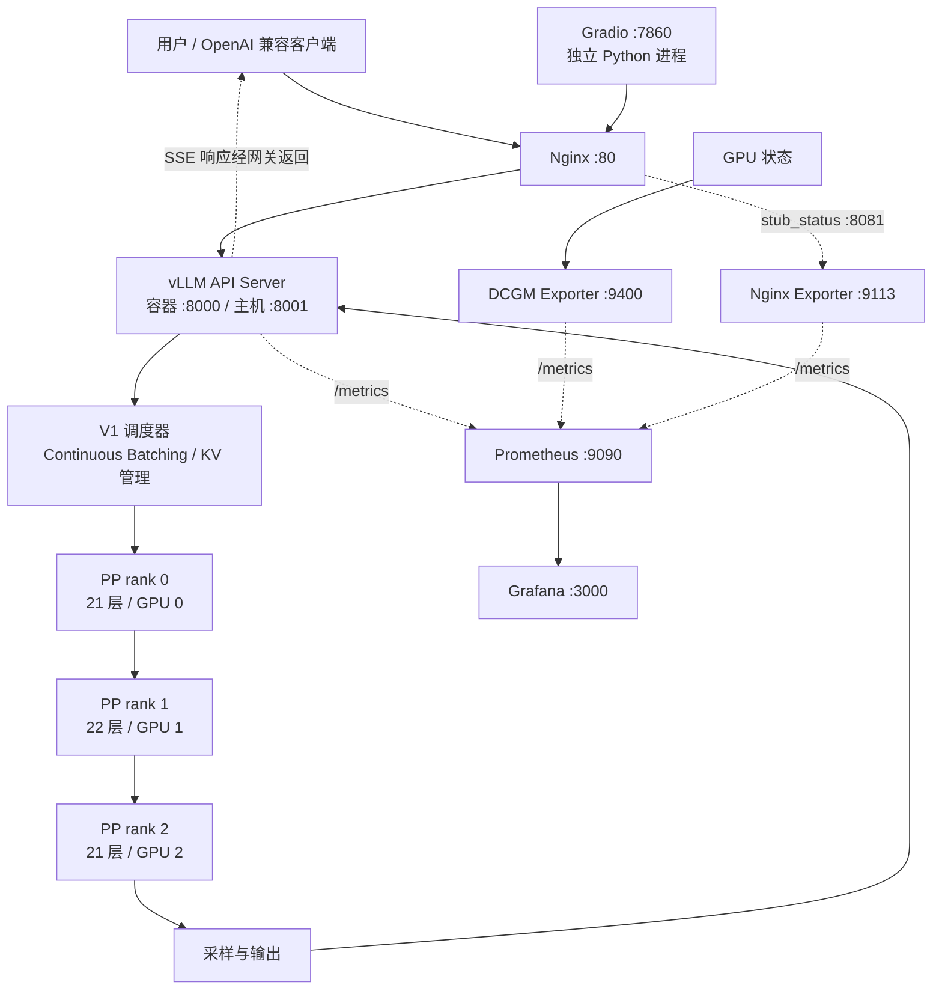

# HeteroServe 架构设计

HeteroServe 的核心问题是：在显存、CPU 和 GPU 互联均受限的单机上，如何把一个 32B 模型变成能够交互、观测和评估的推理服务。设计的重点在于匹配资源约束，并用实验限定服务能力。

本文件依据 [JOURNEY.md](/JOURNEY.md)、实际配置、脚本与原始报告整理。历史日志证明配置能够成功运行；由于运行环境和数据集等不尽完全相同，当前文件快照仍有复现问题，后续迭代会逐步解决。以下分别说明设计选择、已有证据和能力边界。

## 1. 约束与设计目标

| 约束                                     | 设计影响                                     | 选择                             |
| -------------------------------------- | ---------------------------------------- | ------------------------------ |
| 3 × RTX 2080 Ti，每卡 22GB，Turing / sm_75 | 需匹配计算 dtype、attention backend 与量化 kernel | FP16 计算，AWQ 权重，按日志确认实际 backend |
| 无 NVLink，PCIe 宽度 x8 / x8 / x4          | 层内高频集合通信需要谨慎评估                           | 主模型 PP=3 / TP=1                |
| Qwen3-32B 的 64 个 query heads           | 不能直接按 TP=3 均分                            | 按层切分，避开该约束                     |
| 32GB RAM、消费级 CPU 与 NVMe                | 加载、编译及 CPU 调度可能影响启动与延迟                   | 配置 swap，保留启动阶段与运行阶段日志          |
| 主备复用 GPU 0、1                           | 两个实例不能按当前显存预算同时运行                        | 人工切换的冷备模式                      |
| 交互和批处理的需求不同                            | 最大吞吐是系统性能，与用户体验评估区分开。                    | 同时分析吞吐、TTFT、TPOT、排队及质量         |

目标是可解释的单机推理服务原型。硬件采样确认了链路宽度与 PHB 拓扑；第三槽满载 PCIe 代际和实际传输带宽仍需专门测试，不能由空闲时的速率直接推定。

## 2. 请求与观测路径



图中调度、KV 管理、模型执行与采样由 vLLM 提供。箭头表达逻辑依赖，不代表各进程之间精确的 IPC 拓扑。

一次流式请求的过程是：客户端提交模型名与消息，Nginx 执行按 IP 限流并转发；vLLM 校验请求，调度 prefill / decode，经过 PP stages 计算后生成结果；API Server 输出 SSE，Nginx 尽快转发，客户端逐步展示。Prometheus 独立拉取指标，Grafana 查询时序数据，监控查询不参与推理主链路。

## 3. 为什么选择 PP=3

TP 在层内部拆分矩阵运算，需要跨 GPU 合并结果；PP 则按层切分，在 stage 边界传递激活。对于当前三卡和 Qwen3-32B，query-head 整除约束已足以排除常规 TP=3，PCIe 不对称则进一步强化了减少高频跨卡通信的动机。

[主模型启动日志](/logs%20&%20reports/04-EXP1-vllm_main_depoly/exp1-Qwen3-32B-AWQ_launch.log)记录 `pipeline_parallel_size=3`、`tensor_parallel_size=1` 和 21 / 22 / 21 的层切分。两端 stage 还涉及 embedding / 输出层等职责，按层数接近均分不代表耗时严格相同。

`CUDA_DEVICE_ORDER=PCI_BUS_ID` 用于稳定设备枚举。实际 rank 对应哪张卡仍应核对容器可见设备、GPU UUID 与日志，不能只依赖槽位名称。弱链路放在末级的理由也不能简化成“最后只传 token id”：末级仍需接收前一级的激活张量。

PP 的代价包括流水线空泡、stage 不均衡和单请求的顺序依赖。Continuous Batching 有机会提高利用率，但吞吐收益需要测量。现有 14B / TP=2 实验也说明，无 NVLink 并不等于 TP 绝对不可用。

## 4. 模型、量化和算子选择

主模型使用 Qwen3-32B-AWQ，另有 Qwen3-32B-GPTQ、Qwen3-14B FP16 对照。4B 模型先用于冒烟，降低诊断基本运行路径的成本。

| 路线 | 历史运行证据 | 角色 |
| --- | --- | --- |
| 4B + vLLM 0.8.5.post1 | V0 / xFormers | 老版本兼容路径对照 |
| 4B + vLLM 0.21.0 | V1 / FlashInfer | 新版本冒烟 |
| 32B AWQ + vLLM 0.21.0 | V1 / FlashInfer / AWQ-Marlin / PP=3 | 主服务 |
| 32B GPTQ + vLLM 0.21.0 | V1 / FlashInfer / GPTQ-Marlin / PP=3 | 同规模量化对照 |
| 14B FP16 + vLLM 0.21.0 | V1 / FlashInfer / TP=2 | 较快的对照与冷备 |

这里的兼容性结论限定在归档日志中的软件版本、模型和配置。attention backend 与量化 kernel 是两个不同环节；AWQ-Marlin 可用。使用 `--dtype float16` 是加载模型权重的时候，把 BF 16 格式的数据转换为 FP16 再加载到显存，它与权重量化格式不同。

AWQ 的取舍是更小的权重占用、更多 KV 余量以及本项目 C-Eval 结果，绝非所有任务上的速度最优。14B FP16 在 ShareGPT 性能上领先；32B AWQ 与 GPTQ 在该基准中接近。比较同时改变了模型规模、GPU 数量和并行策略，不能从中分离出量化的独立收益或代价。

Flash-Attention-Turing 接入、FlashQLA / GDN 混合模型与 NVLink 路线仍属于研究方向。经过研究，这些算子，特别是 FlashQLA 不应作为现有 dense Qwen3-32B 的替换。dense 模型不具备 GDN 架构， FlashQLA 不适用。

## 5. KV Cache 与并发预算

依据归档启动日志：

| 模型 / 并行 | 日志所示 worker 模型加载内存 | Engine KV token 槽位 | 16K 满长请求容量 |
| --- | ---: | ---: | ---: |
| 32B AWQ / PP=3 | 6.49 GiB | 135,440 | 8.27 |
| 32B GPTQ / PP=3 | 6.45 GiB | 135,904 | 8.29 |
| 14B FP16 / TP=2 | 13.88 GiB | 50,304 | 3.07 |

来源：[AWQ 启动日志](/logs%20&%20reports/04-EXP1-vllm_main_depoly/exp1-Qwen3-32B-AWQ_launch.log)、[14B / GPTQ 启动日志目录](/logs%20&%20reports/05-EXP2-three_models_comparison/)。日志中的 worker 内存值不应当作整机总值，也不足以证明所有 ranks 完全相等。

Engine KV 容量是整套实例可容纳的 token 槽位，不能再乘 GPU 数。当前缓存 dtype 不是因为 AWQ 4bit 权重就自动变成 4bit。可用于规划的近似式为：

```text
请求 active tokens ≈ prompt tokens + 已生成 tokens
满长请求容量 ≈ engine_KV_tokens / max_model_len
不考虑共享前缀时，驻留请求所需 KV ≈ 各请求 active tokens 之和
可调度序列数还受 max_num_seqs 和计算资源限制
```

共享前缀、block 粒度、调度与抢占会改变实际占用，所以容量估算是起点，不是吞吐保证。`max-model-len` 提高允许的单请求上限；如果请求分布不变，并不会机械地为每个短请求预留一个更大的完整窗口。

对于 135,440 槽位，8K 满长容量约 16.53 条、16K 约 8.27 条。Compose 的 `max-num-seqs=64` 允许短请求更多地同时推进，但不保证 64 条 8K 请求同时驻留。可先用 `floor(0.7～0.85 × KV_tokens / P95_active_tokens)` 估算候选上限，再用 P99 长请求、突发负载和实际 SLO 校验；P95 不是最坏情况保证。

Prefix Caching 复用前缀的 prefill 结果；Chunked Prefill 将长输入拆分并与 decode 调度协调。应分别测试冷缓存、热缓存和随机前缀，现有重复提示集上的高命中率不能代表任意 RAG 流量。[vLLM 0.21.0 调优说明](https://docs.vllm.ai/en/v0.21.0/configuration/optimization/)可作为后续控制变量实验的参考。

## 6. 流式网关与冷备边界

[nginx.conf](deploy/nginx.conf) 的设计包括关闭代理响应缓冲、关闭代理缓存、HTTP/1.1、长读取超时和每 IP 5 req/s、burst=10 的限流。SSE 数据块不一定等于一个模型 token；Nginx、TCP 与客户端库均可能改变可见的分块方式。

网关限流限制请求到达速率，没有按输入长度、输出预算或 KV 占用做准入。一个长请求与一个短请求消耗相同的 IP 请求额度，因而仅靠该规则不能稳定控制 GPU 负载。下一步应补充 token 预算、队列等待上限及取消传播。

`main` 和 `backup` profiles 是服务集合选择开关，不提供互斥锁。[Compose 官方说明](https://docs.docker.com/compose/how-tos/profiles/)允许同时启用多个 profiles。当前脚本未确保先停旧实例，两个模式还争用宿主机 80 端口。Nginx 配置不能启动冷备容器，`proxy_next_upstream off` 也禁止同一请求失败后的重试切换。

因此这里的恢复流程应是：停止接收新请求、排空或明确结束在途请求、停止旧模型释放 GPU、启动冷备、确认健康和模型名、切换流量、验证监控。该完整流程尚未自动化；它仍存在恢复时间与单机故障域，不能作为自动 HA。

## 7. 可观测性与服务目标

观测分三个层次：

| 层次 | 指标 | 用途与限制 |
| --- | --- | --- |
| 客户端 / 网关 | E2E、状态码、断流、限流、请求速率 | 反映用户实际体验；现有网关状态码统计尚不完整 |
| vLLM | TTFT、TPOT、tokens/s、running / waiting、KV、preemption | 分析调度与推理；服务端窗口统计不等同客户端全程统计 |
| GPU | 利用率、显存、温度、功耗、采集状态 | 判断设备状态；100% 利用率不等于达到算力或带宽峰值 |

Prometheus 当前每 5s 抓取一次。[看板 JSON](deploy/grafana/dashboards/heteroserve.json)中延迟多使用 1 分钟 histogram rate，前缀命中率多使用 5 分钟窗口。不同指标的记录时点及窗口可能不同，把各曲线上的数字拼成同一请求的延迟，可能造成直方图分位数有桶插值的误差。

Nginx OSS exporter 的 `stub_status` 指标不包含业务状态码分布；现有看板“HTTP 成功率 / 5xx”实际筛选的是 `job="vllm-active"`，不能覆盖网关自身拒绝的请求。[Exporter 指标定义](https://github.com/nginx/nginx-prometheus-exporter)说明了该边界。

原有 SLO 提出 TTFT P99 < 1.5s、TPOT P99 < 80ms 等目标。ShareGPT 中 AWQ 并发 16 已超过这两项，但这是特殊限定条件下的性能表现。后面 locust 压测中使用的设置，更接近上线服务的设置。所以 SLO 基本能达到，但是不是所有条件下都能达到。

## 8. 实验如何支持设计

1. 硬件与环境记录：明确资源和软件版本，为后端选择提供边界。
2. EXP0 / EXP1：先验证 4B 单卡，再验证 32B 多卡；证明路径可运行。
3. EXP2：比较单请求表现，但当前脚本的 SSE 计数存在偏差，结果仅作历史观察。
4. EXP3：9 组 ShareGPT 基准支持吞吐与尾延迟权衡；`--max-concurrency` 是客户端参数，不同于 Locust 实验中的服务端 `max-num-seqs`。
5. EXP4：质量汇总支持选型讨论。C-EVAL 验证集和测试集完整测试数据。
6. KV 分析：用启动日志的 token 槽位解释容量；全窗口扫描的原始日志未完整保存。
7. Locust：12 组模拟负载观察端到端表现；HTML 中存在 3 次 503 失败。
8. Gradio / Runbook：提供交互展示与故障处理入口；Demo 不是标准 benchmark，Runbook 是故障列表，非故障演练全部完成的证据。

## 9. 已知工程缺口

发布前最应完成的是配置可解析、主备切换正确、监控目标与数据源匹配、脚本能够对应归档实验，以及客户端计量可信。

镜像部分使用 `latest`，Python 部分依赖未锁定，模型与数据集未固定 revision；历史运行环境不能由当前文件完全恢复。`ipc: host` 简化了多进程共享内存环境，同时扩大资源共享边界；直连端口和默认凭据也符合实验环境而非隔离的公网部署。

后续迭代应保留这个设计原则：先把资源、测量和失败条件说清楚，再通过可复现实验扩展能力。具体阶段见 [Roadmap.md](Roadmap.md)。