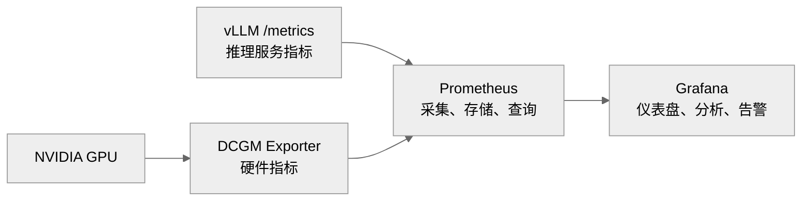
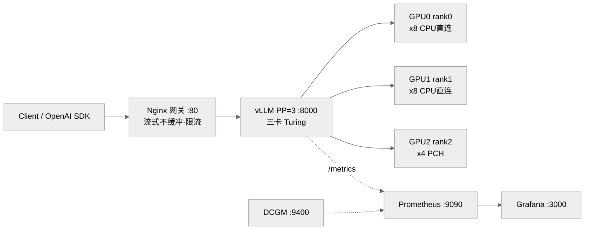

# Phase 0: 约束与技术决策总览
---
## 1. 并行策略

Pipeline Parallelism, PP=3, 流水线并行，三卡将模型按层切分。TP=3 受 KV head 整除性和 PCIe x 4 通信带宽限制，双重排除。 无 NVLink 情况下，优先 PP。
并行策略选择，详见 [01-GPU并行部署策略分析(PP3_vs_TP3)](/docs/analysis%20&%20research/01-GPU并行部署策略分析(PP3_vs_TP3).md)
## 2. 主模型选型

主模型选定 Qwen3-32B-AWQ。这是当下主流的基准模型。AWQ-32B 是消费级硬件能跑的“最大模型”甜点。
- AWQ 在vLLM中有 Marlin Kernel 优化，推理速度快。
- AWQ 是激活感知量化，保留重要通道精度，质量通常优于 GPTQ
- Qwen3-32B FP16 完全版, 权重需要显存 64GB 塞不下，最佳选择 AWQ 量化版。
作为测试和对照，同样选用了模型 Qwen3-4B(快速验证)，Qwen3-14B FP16，以及 Qwen3-32B-GPTQ。关于模型选型，详见[02-LLM模型选择](/docs/analysis%20&%20research/02-LLM模型选择.md)
## 3. Turing架构关键约束

vLLM 框架支持 cc 最低为 7.5 (即 sm_75)，但是 vLLM 中attention 算子的 backend 不一定支持。官方 FlashAttention V2 算子实现不支持 sm_75.
关于算子的讨论，详见[03-算子架构与原理](/docs/analysis%20&%20research/03-算子架构与原理.md) . 
关于模型，部署框架，和GPU架构之间适配性讨论，详见[04-模型、框架与GPU架构适配性](/docs/analysis%20&%20research/04-模型、框架与GPU架构适配性.md)
关于attention backend的讨论，详见 [06-vLLM attention backend](/docs/analysis%20&%20research/06-vLLM%20attention%20backend.md)

我们会用 xFormers, FlashInfer, FlashQLA, 对FlashAttention V2 进行算子替换。
关于 xFormers 的讨论详见 [07-xFormers](/docs/analysis%20&%20research/07-xFormers.md)

Turing 架构算力版本 CC 为 sm_75。Turing 无 BP16 硬件，无 FP8 硬件，支持 FB16。Qwen3-32B, 使用 BP16 训练，数据格式不兼容。我们使用 Qwen3-32B 的 INT4 的量化版本AWQ ，Qwen3-32B-AWQ。

关于 Turing 架构的约束分析，详见[08-Turing架构sm_75约束分析](/docs/analysis%20&%20research/08-Turing架构sm_75约束分析.md) 

## 4. attention backend 的选择

attention backend 的选择，我们将 vLLM 官方内置的 attention 算子和 社区针对 sm_75 的做出的解决方案，进行工程实践，以验证可行性与效率：

- `flash-atten`: Flash Attention 官方默认 backend。
- `flashinfer`: 官方宣称支持 sm_75, 但非所有 feature 都支持，实际情况有待验证。
- `triton`: 官方宣称支持 sm_75，实际支持是否稳定，有待验证。
- `flash-attention-turing`: ssiu 实现的支持 turing 架构的 attention 算子. FA 官方认可的 Turing路线，虽然没有被FA官方仓库merge，但在README明确推荐 Turing 用户的去处。
- `flashQLA-sm70-sm75`: weicj 将 FlashQLA移植到 sm_70/sm_75, 测试推理速度 101 tk/s。需要另一个独立方案，用 2 x 2080ti + NvLink, TP=2, Qwen3.6-27B-AWQ. 验证方案是否可行，执行效率是否如预期。 

更具体的算子选择的决策，详见[09-vLLM backend算子选择](/docs/analysis%20&%20research/09-vLLM%20backend算子选择.md) 
vLLM对算子的选择，与框架引擎相关，详见[10-vLLM 引擎-V0与V1 ](/docs/analysis%20&%20research/10-vLLM引擎-V0与V1.md)
## 5. PCIe 3.0 通信约束与 slot 绑定

项目使用的主板是 ASUS Z270A，消费级主板，具有 3 个PCIe 3.0 x 16 插槽，但实际带宽受 CPU lane的影响，数据宽度无法做到 x16/x16/x16, 只能做到 x8/x8/x4。

由于带宽限制，以及3个PCIe 3.0 插槽的带宽不均等。根据 GPU通信的需求和特点，我们需要绑定 PCIe slot 与 PP=3 中的 rank，我们要对 pp=3 中的 rank，充分利用带宽，提高效率。

关于 PCIe 3.0 的协议约束，带宽分析, 以及 slot/rank 绑定策略，详见 [11-PCIe接口约束分析与架构设计](/docs/analysis%20&%20research/11-PCIe接口约束分析与架构设计.md)

## 6. 内存约束与解决方案

主板内存，8GB x 4 = 32 GB, 主存频率为 DDR4-2666 MHz。32GB的内存在模型加载到显存的过程中，可能不够用。这时我们需要将部分 Nvme 设置为虚拟内存来使用。内存 + 虚拟内存主要是用在模型的加载阶段，之后使用模型进行推理的阶段，更多使用的是 GPU 的显存。
我们把虚拟内存设置为 32GB。

## 7.  完整决策日志

讨论过的决策汇总：

| #   | 决策点                  | 选择                              | 否决方案             | 核心理由                          |
| --- | -------------------- | ------------------------------- | ---------------- | ----------------------------- |
| 1   | 主模型                  | Qwen3-32B-AWQ                   | Qwen3-14B / FP16 | AWQ 是消费级硬件能跑的最大模型甜点           |
| 2   | 并行                   | PP=3                            | TP=3             | TP=3 attention heads 不整除      |
| 3   | attention<br>backend | FlashInfer/xFomers<br>/FlashQLA | FA2/FA3          | 需要支持 sm_75 算力版本的 kernel 算子实现。 |
| 4   | 平台                   | Z270-A                          | X99 / X299       | PP 通信量小，PCIe 不是瓶颈，ROI 差       |
| 5   | CPU                  | i7-7700                         | i7-7700K / E3 系列 | 4核8线程，加载模型时，多线程处理能力够用         |
| 6   | 内存                   | 32GB + 32GB swap                | 升 64GB           | NVMe swap 实测可用                |
| 7   | 系统盘                  | NVMe                            | 维持 SATA SSD      | 加载快 6 倍 + swap 救场             |
| 10  | 集群架构                 | 单机多卡                            | 双机分布式            | 消费级网络物理瓶颈，IB 非消费级成本           |


# Phase 1: 硬件拓扑与带宽测试
---
## 1. 硬件设置 BIOS

进入系统前，我们需要在 BIOS 下进行一些设置，打开硬件层面对多卡系统的支持。主要设置包括

- 打开 PCIe 接口对于超过 4G 的解码寻址。对于多卡必须打开的选项。
```
Above 4G Decoding: Enabled      ← 多卡必开
Re-Size BAR Support: Enabled 
```

- 将 PCIe 速度设置为 3.0 
```
PCIe Speed: Auto (Gen3)          ← PCIe3.0
```

- 让内存频率跑到 2666Hz
```
XMP Profile: Profile 1       ← 让内存跑 2666
```

关于BIOS的关键设置，详见 [01_hw_setup](/docs/01_hw_setup.md)
## 2. 硬件参数与拓扑结构

HeteroServe 生产节点采用硬件环境汇总如下：

| HW  | 型号                      | 说明                                                                     | 备注                                 |
| --- | ----------------------- | ---------------------------------------------------------------------- | ---------------------------------- |
| 主板  | ASUS Z270               | CPU x16 lanes, 3 x PCIe 3.0_16                                         | CPU 最多可以有16条 PCIe 直连通路。            |
| CPU | Intel Core i7-7         | 4C/8T, 3.6/4.2 GHz, 65W TDP                                            |                                    |
| 内存  | 32GB + 32GB Swap on     | 4×8GB, 32GB DDR4-2666 MHz                                              | 32GB Swap on Nvme(`vm.swapness=1`) |
| 存储  | 512GB NVME SSD on M.2_1 | `/`: Ubuntu 24.04 LTS<br>`/opt/models`: 模型文件<br>`/swapfile`: 32GB swap | <br>M.2_2 预留第二阶段扩展                 |
| 电源  | 1650W                   | -                                                                      | -                                  |
| GPU | 3 x RTX 2080Ti 22GB     | cc, sm_75, 显存 66GB                                                     | 第二阶段扩展至 4 x 2080ti, 显存88GB, TP=4   |
平台硬件拓扑结构如下：

```
                  CPU (i7-7700, LGA1151)
                  16 lanes PCIe 3.0
                          │
            ┌─────────────┼─────────────┐
         x8 │          x8 │             │
    [Slot 1]│      [Slot 2]│             │
    GPU #1  │      GPU #2  │             │
    (22GB)  │      (22GB)  │             │
                                         │ DMI 3.0 (~4 GB/s)
                                         │
                                  Z270 PCH
                  ┌──────────────────────┼──────────────┐
               x4 │                   x4 │              │
         [Slot 3] │              [M.2_2] │              │
         GPU #3   │              GPU #4  │              │
         (22GB)   │              (22GB)  │              │
                                         │ x4
                                  [M.2_1] NVMe SSD
                                  
                                  (其他 PCH 设备：
                                  SATA, USB, x1 槽, 网卡)
                                  
                                  全部共享 DMI 3.0 总带宽
```

更详细的硬件配置说明，参考 [01_hw_setup](/docs/01_hw_setup.md)
## 3. 硬件测试

进入系统后我们通过测试脚本，对硬件进行了测试。测试结果简要汇总如下：

```
CPU: 4 Cores, 2 thread /core, 3.6GHz
Memory: 4 x Size: 8GB, Speed: 2667 MT/S
GPU: NVIDIA GeForce RTX 2080Ti, 22528 MiB
PCIe topo: PHB
...
... 
```


测试脚本，详见 [01_hw_verify.sh](/scripts/01_hw_verify.sh)。 硬件测试报告，详见[01-hw_report.txt](/logs%20&%20reports/01-hw_report.txt)

硬件测试报告中，我们重点关注 PCIe 带宽状况
- PCIEX16_1：CPU 直连 PCIe 3.0 **x8**
- PCIEX16_2：CPU 直连 PCIe 3.0 **x8**
- PCIEX16_3：PCH，PCIe 2.0 **x4**（上行经 DMI 3.0，带宽与其它 PCH 设备共享）

i7-7700 只有 16 条 CPU 直连 PCIe lane，两张 x8 卡占满；第三张只能挂 PCH。这是本项目消费级平台的物理上限 (对比：服务器 EPYC 可达 128 条 CPU 直连 lane)。idle 时三卡链路速率降到 2.5 GT/s 是 NVIDIA ASPM 省电的正常行为——看 width(x8/x8/x4) 而非 idle 速率，width 才是有意义的指标。
关于硬件测试的详细分析，参见 [12-hw_report_analysis](/docs/analysis%20&%20research/12-hw_report_analysis.md)

硬件测试结果，与硬件分析的预期完全一致。


# Phase 2: 环境搭建与软件版本
---
## 1. 核心软件组件版本

使用环境简要汇总如下：

| 组件            | 锁定版本             | 备注             | 适配  |
| ------------- | ---------------- | -------------- | --- |
| OS            | Ubuntu 24.04 LTS | 最新操作系统         | ✅   |
| NVIDIA Driver | 595.71.05        | 支持 CUDA 13.2   | ✅   |
| CUDA Toolkit  | 13.2             | vLLM 官方镜像对应    | ✅   |
| Python        | 3.11             | 3.12 部分库尚未完全适配 | ✅   |
| PyTorch       | 2.11.0           | 2.11.0+cu130   | ✅   |
| **vLLM**      | 0.21.0           | **原生支持 Qwen3** | ✅   |
| Transformers  | ≥ 4.51.0         | Qwen3 必需       | ✅   |

完整的软件组件和版本信息，与更详细的软件安装说明与版本选择说明，参见[02_sw-env_setup](/docs/02_sw-env_setup.md)

项目在两个 vLLM 的版本下进行测试，以测试后端算子性能和整体的推理速度。两个版本分别是 `v0.8.5.post1` 和 `v0.21.0`. 软件安装的环境配置。

0.8.5.post1 版本完整的环境变量，参考 [environment-vllm0.8.5.yml](/environment-vllm0.8.5.yml) 
0.21.0 版本完整的环境变量，参考   [environment.yml](/environment.yml) 

我们以 vLLM-v0.21.0 作为主版本进行配置。

## 2. 系统环境调优

系统环境调优主要包括，Swap设置，网络性能，关闭THP，CPU性能模式等。系统环境调优详细说明参考 [02_sw-env_setup](/docs/02_sw-env_setup.md).
系统环境调优脚本，参见 [02_sys_opt.sh](/scripts/02_sys_opt.sh)
调优执行结果为 [02-sys_opt_report.txt](/logs%20&%20reports/02-sys_opt_report.txt)


# Phase 3:  EXP0-Qwen3-4B 冒烟测试 smoke test
---

首先用 Qwen3-4B 模型进行单卡冒烟测试, 验证整条链路 vLLM启动 -> API 响应能跑通。
先进行单卡启动。然后在另一终端进行 <u>单次测试</u> 与 <u>流式测试</u>

Qwen3-4B 模型在两个环境中测试，vLLM 0.8.5.post1 与 vLLM 0.21.0。前者走的是 v0 引擎，后端算子是 xFormers。而新的 vLLM 版本将 v0 引擎彻底抛弃，改用 v1 引擎，后端算子使用的是Flashinfer。

Qwen3-4B 单卡冒烟测试，详细说明，参见[03-exp0-Qwen3-4B_smoke_test](/docs/03-exp0-Qwen3-4B_smoke_test.md)
在 vLLM 0.8.5.post1 中的启动日志，参见 [exp0-Qwen3-4B_launch_0_8_5.log](/logs%20&%20reports/03-EXP0-smoke_test/exp0-Qwen3-4B_launch_0_8_5.log)
在 vLLM 0.21.0 中的启动日志，参见 [exp0-Qwen3-4B_launch_0_21_0.log](/logs%20&%20reports/03-EXP0-smoke_test/exp0-Qwen3-4B_launch_0_21_0.log)
Qwen3-4B 单卡冒烟测试。测试说明与分析，参见[03-exp0-Qwen3-4B_smoke_test](/docs/03-exp0-Qwen3-4B_smoke_test.md)

在冒烟测试中，vLLM 服务启动后，首次推理，出现了Bug. 这个 Bug 在 vLLM Github仓库中 已经提及 `issue#45597`，目前 open、无 assignee、无 PR、**没有合入的修复**。在测试中，我们从外部给它打上 Patch 解决了问题。
详细的错误日志，参考 [exp0-Qwen3-4B-Error.log](/logs%20&%20reports/03-EXP0-smoke_test/exp0-Qwen3-4B-Error.log)
我们打上 Patch 之后，问题解决了。

冒烟测试结果：vLLM 能够正常部署 Qwen3-4B 大模型。vLLM启动符合预期，curl 返回正确 JSON。流式响应每个Token 立即返回。CPU利用率正常。


# Phase 4: EXP1-Qwen3-32B-AWQ 主线模型上线 PP=3
---
经过冒烟测试，vLLM 框架的配置问题，后端算子使用和选择等问题，已经解决。然后启动主线模型上线。

## 1. Qwen3-32B-AWQ 主模型启动上线

主模型上线的完整启动脚本，参见 [06-exp1-Qwen3-32B-AWQ_launch.sh](/scripts/06-exp1-Qwen3-32B-AWQ_launch.sh)
主模型上线的完整启动日志，参见 [exp1-Qwen3-32B-AWQ_launch.log](/logs%20&%20reports/04-EXP1-vllm_main_depoly/exp1-Qwen3-32B-AWQ_launch.log)

vLLM 部署主模型 Qwen3-32B-AWQ 启动参数如下：

| 指标                     | 值                                |
| ---------------------- | -------------------------------- |
| vLLM 版本                | 0.21.0 v1引擎                      |
| 模型                     | Qwen3-32B-AWQ (Qwen3ForCausalLM) |
| dtype                  | float16                          |
| 量化 kernel              | awq_marlin → MarlinLinearKernel  |
| 并行                     | PP=3, TP=1                       |
| max_model_len          | 16,384                           |
| gpu_memory_utilization | 0.90                             |
| max_num_seqs           | 64                               |
| compile 模式             | VLLM_COMPILE (mode=3)            |
| cudagraph 模式           | FULL_AND_PIECEWISE               |
| 注意力后端                  | FLASHINFER                       |
| NCCL 版本                | 2.28.9                           |
| 单 rank 权重显存            | 6.49 GiB × 3，全模型约 ～20GB          |
| 层切分                    | 21 / 22 / 21                     |
| KV cache 容量            | 135,440 tokens                   |
| 最大并发                   | 8.27x @ 16K                      |
| 可用 KV 显存               | 10.85 GiB                        |
| CUDAGraph 显存池          | 0.24 GiB (实际) / 0.50 GiB (估)     |
| gpu_mem_util 等效值       | 0.90 ≈ 0.8767（扣 CUDAGraph 后）     |
模型总启动时间，包含权重加载，模型加载(含建结构), Dynamo bytecode 转换, 编译 range (1,2048) , torch.compile 合计 , CUDAGraph capture , profiling / warmup, engine init. 
总墙钟启动时间：<u><b>～74 秒</b></u>。

关于主模型 Qwen3-32B-AWQ 上线的详细讨论，参见[04-exp1-Qwen3-32B-AWQ_launch PP=3](/docs/04-exp1-Qwen3-32B-AWQ_launch%20PP=3.md)

## 2. 服务测试与流式测试

验证服务，通过执行脚本 [07-exp1-Qwen3-32B-AWQ_single_test.sh](/scripts/07-exp1-Qwen3-32B-AWQ_single_test.sh)
脚本执行的结果日志，参考 [exp1-Qwen3-32B-AWQ_single_test.log](/logs%20&%20reports/04-EXP1-vllm_main_depoly/exp1-Qwen3-32B-AWQ_single_test.log)

正常的服务访问，测试正确。

流式测试，执行脚本参考 [08-exp1-Qwen3-32B-AWQ_stream_test.sh](/scripts/08-exp1-Qwen3-32B-AWQ_stream_test.sh)
流式测试的结果日志，参考 [exp1-Qwen3-32B-AWQ_stream_test.log](/logs%20&%20reports/04-EXP1-vllm_main_depoly/exp1-Qwen3-32B-AWQ_stream_test.log)

正常服务访问与流式访问，都能正确执行。并且通过服务端的日志，可以看出，流式访问时，推理速度平均是 27 tok/s。但注意⚠️，这是在单个用户请求下的推理速度，不能等同于系统吞吐量。

## 3. 结论

使用 vLLM 0.21.0 部署框架，在 sm_75 (Turing) + FlashInfer + PP=3 组合下，部署大模型 Qwen3-32B-AWQ,  torch.compile 与 CUDAGraph（PIECEWISE + FULL）capture 均成功，无回退、无报错。 主模型顺利上线。

# Phase 5:  EXP2-量化对比实验
---
主模型上线后，我们引入 Qwen3-14B FP16 的完整版 和 Qwen3-32B 的另一个量化版本，GPTQ。三个模型进行横向量化对比。 主要对延时和量化等指标进行对比。

关于量化对比实验详细信息，参考 [05-exp2-Three-Models-Comparison](/docs/05-exp2-Three-Models-Comparison.md)
## 1. 模型启动

- 主模型 Qwen3-32B-AWQ 的启动脚本，详见 [06-exp1-Qwen3-32B-AWQ_launch.sh](/scripts/06-exp1-Qwen3-32B-AWQ_launch.sh).
  启动日志，详见 [exp1-Qwen3-32B-AWQ_launch.log](/logs%20&%20reports/04-EXP1-vllm_main_depoly/exp1-Qwen3-32B-AWQ_launch.log)

- Qwen3-14B-FP16 的启动脚本，详见[09-exp2-Qwen3-14B-FP16_launch.sh](/scripts/09-exp2-Qwen3-14B-FP16_launch.sh) . 注意设置TP=2，由于模型没有量化，所以不需要设置 Marlin Kernel 做加速。
  启动日志，详见 [exp2-Qwen3-14B-FP16_launch.log](/logs%20&%20reports/05-EXP2-three_models_comparison/exp2-Qwen3-14B-FP16_launch.log)

- Qwen3-32B-GPTQ-Int4 的启动脚本，详见 [10-exp2-Qwen3-32B-GPTQ_launch.sh](/scripts/10-exp2-Qwen3-32B-GPTQ_launch.sh). 注意，Marlin Kernel 要修改为`gptq_marlin`.
  启动日志，详见 [exp2-Qwen3-32B-GPTQ_launch.log](/logs%20&%20reports/05-EXP2-three_models_comparison/exp2-Qwen3-32B-GPTQ_launch.log)

## 2. 性能测量

三个模型分别启动服务，执行同一个测试脚本，对测试数据进行统计分析：

测试脚本，参考 [11-exp-Three-Comparison-bench-latency.py](/scripts/11-exp2-Three-Comparison-bench_latency.py)

Qwen3-32B-AWQ 的测试结果数据，详见 [exp2-Qwen3-32B-AWQ_run.json](/logs%20&%20reports/05-EXP2-three_models_comparison/exp2-Qwen3-32B-AWQ_run.json)
Qwen3-14B-FP16 的测试结果数据，详见 [exp2-Qwen3-14B-FP16_run.json](/logs%20&%20reports/05-EXP2-three_models_comparison/exp2-Qwen3-14B-FP16_run.json)
Qwen3-32B-GPTQ 的测试结果数据，详见 [exp2-Qwen3-32B-GPTQ_run.json](/logs%20&%20reports/05-EXP2-three_models_comparison/exp2-Qwen3-32B-GPTQ_run.json)

测试结果数据，经过分析汇总后得到：

| 模型/指标          | TTFT(s) | TPOT(s) | TPUT(tk/s) | 权重显存(GiB/卡) | 最大并发       |
| -------------- | ------- | ------- | ---------- | ----------- | ---------- |
| Qwen3-32B-AWQ  | 0.079   | 0.036   | 27.12      | 6.49        | 8.27x @16k |
| Qwen3-14B-FP16 | 0.055   | 0.028   | 35.29      | 13.88       | 3.07x @16K |
| Qwen3-32B-GPTQ | 0.080   | 0.036   | 27.31      | 6.45        | 8.29x @16k |
## 3. 结论

量化版模型即使在 vLLM 的 Marlin Kernel 优化下，推理速度和吞吐量依然不敌完整版的模型，但是，完整版模型占用的权重显存远远高于量化版模型. 因此，留给 KV Cache 的部分就更少，能够支撑的最大并发数也就最少。量化版本的显存占用明显低于完整版，代价就是数据精度受到影响，并且推理速度偏慢。但目前硬件条件下，Qwen3-32B-AWQ 是最佳选择。 


# Phase 6: EXP3-基准测试
---

使用 vLLM 官方 Benchmark 工具，对 Qwen3-32B-AWQ, Qwen3-14B-FP16, Qwen3-32B-GPTQ 使用`vllm bench`  进行 Benchmark， 分析测试结果。

## 1. Benchmark 基准测试

对 Qwen3-32B-AWQ, Qwen3-14B-FP16, Qwen3-32B-GPTQ 三个模型都发出 500 个 prompts, 并且设置它们的最大并发处理请求数，分别设置为4， 16， 64。获得 9 组原始测试数据结果。

| Qwn3-xx  | 4                                                                                                                                                                                                                      | 16                                                                                                                                                                                                                         | 64                                                                                                                                                                                                                         |
| -------- | ---------------------------------------------------------------------------------------------------------------------------------------------------------------------------------------------------------------------- | -------------------------------------------------------------------------------------------------------------------------------------------------------------------------------------------------------------------------- | -------------------------------------------------------------------------------------------------------------------------------------------------------------------------------------------------------------------------- |
| 32B-AWQ  | [qwen3-32b-awq_c4.log](/logs%20&%20reports/06-EXP3-vllm_bench_benchmarks/results/qwen3-32b-awq_c4.log)<br>[qwen3-32b-awq_c4.json](/logs%20&%20reports/06-EXP3-vllm_bench_benchmarks/results/qwen3-32b-awq_c4.json)     | [qwen3-32b-awq_c16.log](/logs%20&%20reports/06-EXP3-vllm_bench_benchmarks/results/qwen3-32b-awq_c16.log)<br>[qwen3-32b-awq_c16.json](/logs%20&%20reports/06-EXP3-vllm_bench_benchmarks/results/qwen3-32b-awq_c16.json)     | [qwen3-32b-awq_c64.log](/logs%20&%20reports/06-EXP3-vllm_bench_benchmarks/results/qwen3-32b-awq_c64.log)<br>[qwen3-32b-awq_c64.json](/logs%20&%20reports/06-EXP3-vllm_bench_benchmarks/results/qwen3-32b-awq_c64.json)     |
| 14B-FP16 | [qwen3-14b-fp16_c4.log](/logs%20&%20reports/06-EXP3-vllm_bench_benchmarks/results/qwen3-14b-fp16_c4.log)<br>[qwen3-14b-fp16_c4.json](/logs%20&%20reports/06-EXP3-vllm_bench_benchmarks/results/qwen3-14b-fp16_c4.json) | [qwen3-14b-fp16_c16.log](/logs%20&%20reports/06-EXP3-vllm_bench_benchmarks/results/qwen3-14b-fp16_c16.log)<br>[qwen3-14b-fp16_c16.json](/logs%20&%20reports/06-EXP3-vllm_bench_benchmarks/results/qwen3-14b-fp16_c16.json) | [qwen3-14b-fp16_c64.log](/logs%20&%20reports/06-EXP3-vllm_bench_benchmarks/results/qwen3-14b-fp16_c64.log)<br>[qwen3-14b-fp16_c64.json](/logs%20&%20reports/06-EXP3-vllm_bench_benchmarks/results/qwen3-14b-fp16_c64.json) |
| 32B-GPTQ | [qwen3-32b-gptq_c4.log](/logs%20&%20reports/06-EXP3-vllm_bench_benchmarks/results/qwen3-32b-gptq_c4.log)<br>[qwen3-32b-gptq_c4.json](/logs%20&%20reports/06-EXP3-vllm_bench_benchmarks/results/qwen3-32b-gptq_c4.json) | [qwen3-32b-gptq_c16.log](/logs%20&%20reports/06-EXP3-vllm_bench_benchmarks/results/qwen3-32b-gptq_c16.log)<br>[qwen3-32b-gptq_c16.json](/logs%20&%20reports/06-EXP3-vllm_bench_benchmarks/results/qwen3-32b-gptq_c16.json) | [qwen3-32b-gptq_c64.log](/logs%20&%20reports/06-EXP3-vllm_bench_benchmarks/results/qwen3-32b-gptq_c64.log)<br>[qwen3-32b-gptq_c64.json](/logs%20&%20reports/06-EXP3-vllm_bench_benchmarks/results/qwen3-32b-gptq_c64.json) |

## 2. 测试结果分析

关于详细的 benchmark 数据和测试说明，参考 [06-exp3-vllm_bench_benchmarks](/docs/06-exp3-vllm_bench_benchmarks.md)
Benchmark 测试结果汇总如下：

|模型|并发|输出 tok/s|mean TTFT|p99 TTFT|mean TPOT|p99 TPOT|
|---|---|---|---|---|---|---|
|Qwen3-14B-FP16|4|117.4|207ms|489ms|33.0ms|44.4ms|
|Qwen3-14B-FP16|16|297.0|283ms|1693ms|51.2ms|76.3ms|
|Qwen3-14B-FP16|64|579.0|879ms|6865ms|109.0ms|403.0ms|
|Qwen3-32B-AWQ|4|91.0|382ms|989ms|41.9ms|63.5ms|
|Qwen3-32B-AWQ|16|241.7|531ms|2355ms|62.1ms|111.0ms|
|Qwen3-32B-AWQ|64|381.5|1942ms|16713ms|175.6ms|827.9ms|
|Qwen3-32B-GPTQ|4|91.4|385ms|1008ms|41.8ms|64.1ms|
|Qwen3-32B-GPTQ|16|239.7|545ms|2386ms|62.5ms|115.5ms|
|Qwen3-32B-GPTQ|64|375.8|2028ms|17297ms|177.6ms|891.4ms|

matplotlib 绘制并发-性能曲线对比图如下：


## 3. 结论

1.  **Qwen3-14B-FP16 全面领先**：吞吐和延迟在所有并发下都是最好。相对 32B 量化模型，输出吞吐高约 **23%-54%**，mean TTFT 低约 **46%-57%**。
2. **32B-AWQ 和 32B-GPTQ 性能几乎一样**：AWQ 在 c16/c64 略快一点，大概 **1%-2%**，尾延迟也略低，但差距很小。
3. **c16 是最均衡的并发点**：相比 c4，吞吐提升约 **2.5-2.7 倍**，但延迟还没有失控。c64 虽然吞吐最高，但 p99 延迟恶化明显。
4. **c64 更像批处理场景**：32B 两个模型在 c64 下 p99 TTFT 已经到 **16.7-17.3 秒**，p99 TPOT 接近 **0.8-0.9 秒/token**，交互体验会很差。
5. 32B：优先 c16；c64 谨慎用于非交互批量任务。
6. 模型选型不能只按性能区分，还要部署兼容性、显存、模型质量。

总结：Qwen3-14B-FP16 在性能上全面领先，但是模型大小只有 14B 。Qwen3-32B-AWQ 和 Qwen3-32B-GPTQ 虽然性能上稍逊。但是它们是 32B 模型是320亿参数，是16B 模型约 2.5倍。14B模型启动后，每张卡被占用～14GB显存，只有 3.84 GiB 的 KV Cache, 但是32B量化模型只有6.5 GiB 的显存占用，留有约11GB显存，理论上可以提供更多的并发处理能力。

benchmark 测试只能评估模型推理的性能，但是对于模型质量，运行效果而言，无法提供评测。我们在模型选型的时候，不能只考虑模型的性能，还要考虑模型质量，效果，参数规模等因素。

benchmark 数据表明，32B 量化模型，在 c16  的时候，综合表现最好。 c64 虽然系统整体吞吐量提高明显，但是 P99 TTFT 和 P99 TPOT 退化严重已经失控。所以 32B 量化模型最好选择 c16 的运行模式。

# Phase 7: EXP4-质量评估
---
除了模型的推理性能之外，我们还需要对模型的推理质量进行评估。更详细的模型质量评估方案，参考 [07-exp4-ceval_quality_evaluations](/docs/07-exp4-ceval_quality_evaluations.md)

## 1. 测试数据集

我们使用的是 C-Eval 中文考试测评集来对模型进行推理质量测试。C-Eval 全称是 C-Eval: A Multi-Level Multi-Discipline Chinese Evaluation Suite for Fundation Models. 包含中文单项选择题，覆盖 52 个学科，包括 中学/高中/大学/职业 等多个难度层级。它主要用于评估基础模型在中文语境下的知识和推理能力。

数据来源是 Hugging Face 上的数据仓库，`ceval/ceval-exam`, 属于 C-Eval Benchmark。ceval 测评数据集上共有两种数据集，一种是验证集 val，具有52个科目(subject)，1364个测试用例/问题。一种是正式测试集 test，共有52个科目， 12342个测试用例/问题。

## 2. 核心指标

评价模型推理质量，最核心的指标就是正确率，即答对题目数比上总题目数。具体使用的正确率指标，主要有两个统计口径：
- macro average: 每个科目单独计算正确率，对全部正确率求平均值。即所有科目权重相同。
- micro average: 所有52个科目的所有题目，回答正确数比上全部题目数，即所有题目权重相同。
两个统计口径，都是重要反映推理质量的指标。

## 3. 测试说明

Qwen3-32B-AWQ, Qwen3-14B-FP16, Qwen3-32B-GPTQ 三个模型，分别在 thinking 和 nonthinking 模式下，在 val 验证集上跑，计算模型推理的正确率。

在 nonthinking 模式下，三个模型再运行完整的正式测试集 test, 计算模型推理的正确率。
统计口径包括 macro average 、micro average、以及局部 52 个科目各自正确率。

实际执行测试过程中，thinking 模式的推理速度比 non-thinking 的推理速度慢了接近 100 倍。在val上，完整跑完 52个科目，1364 个测试用例。一个模型就要花 ～1.5天。test 共52个科目， 12342测试用例，全部跑完三个模型，大约需要 45 天。
在 val 上已经能够对比出 thinking 模式与 nonthinking 模式之间的推理质量差异。所以test测试集上的测试，只执行了 nonthinking 模式。

## 4. 测试结果

### val 验证数据集

在 val 验证集上，52个科目，1364个测试用例上，在 thinking 和 non-thinking 模式下分别进行测试

|                                  | Macro Avg % | Micro Avg % | correct | total | subjects | serial tput <br>(tok/s) |
| -------------------------------- | ----------- | ----------- | ------- | ----- | -------- | ----------------------- |
| Qwen3-32B-AWQ<br>(non-thinking)  | 82.70       | 82.47       | 1110    | 1346  | 52       | 4.2                     |
| Qwen3-32B-AWQ<br>(thinking)      | 85.20       | 84.03       | 1131    | 1346  | 52       | 27.8                    |
| Qwen3-14B-FP16<br>(non-thinking) | 79.22       | 78.68       | 1059    | 1346  | 52       | 6.5                     |
| Qwen3-14B-FP16<br>(thinking)     | 82.50       | 80.91       | 1089    | 1346  | 52       | 35.6                    |
| Qwen3-32B-GPTQ<br>(non-thinking) | 82.10       | 81.72       | 1100    | 1346  | 52       | 4.2                     |
| Qwen3-32B-GPTQ<br>(thinking)     | 84.2        | 83.0        | 1116    | 1346  | 52       | 27.2                    |

关于每个subject的正确率以及详细的测试结果，详见测试产生的 json 数据结果：

non-thinking 模式下，详见[ceval_val_qwen3-32b-awq_nonthinking.json](/logs%20&%20reports/07-EXP4-ceval_quality_evaluations/ceval_val_qwen3-32b-awq_nonthinking.json), [ceval_qwen3-14b-fp16_nonthinking.json](/logs%20&%20reports/07-EXP4-ceval_quality_evaluations/ceval_val_qwen3-14b-fp16_nonthinking.json),  [ceval_val_qwen3-32b-gptq_nonthinking.json](/logs%20&%20reports/07-EXP4-ceval_quality_evaluations/ceval_val_qwen3-32b-gptq_nonthinking.json)

thinking 模式下，详见[ceval_val_qwen3-32b-awq_thinking.json](/logs%20&%20reports/07-EXP4-ceval_quality_evaluations/ceval_val_qwen3-32b-awq_thinking.json), [ceval_val_qwen3-14b-fp16_thinking.json](/logs%20&%20reports/07-EXP4-ceval_quality_evaluations/ceval_val_qwen3-14b-fp16_thinking.json), [ceval_val_qwen3-32b-gptq_thinking.json](/logs%20&%20reports/07-EXP4-ceval_quality_evaluations/ceval_val_qwen3-32b-gptq_thinking.json)

然后我们对其进行统计画出直方图

nonthinking 模式下, split="val"：Qwen3-32B-AWQ .VS. Qwen3-14B-FP16 .VS. Qwen3-32B-GPTQ 52个科目正确率表现如下


thinking 模式下，split = 'val':  Qwen3-32B-AWQ .VS. Qwen3-14B-FP16 .VS. Qwen3-32B-GPTQ 52个科目正确率表现如下：


完整统计图，参看
nonthinking 模式下：
[ceval_val_qwen3-32b-awq_nonthinking.png](/docs/assets/EXP4_assets/ceval_val_qwen3-32b-awq_nonthinking_qwen3-32b-awq_stacked_subject_bars.png),
[ceval_val_qwen3-14b-fp16_nonthinking.png](/docs/assets/EXP4_assets/ceval_val_qwen3-14b-fp16_nonthinking_qwen3-14b-fp16_stacked_subject_bars.png), 
[ceval_val_qwen3-32b-gptq_nonthinking.png](/docs/assets/EXP4_assets/ceval_val_qwen3-32b-gptq_nonthinking_qwen3-32b-gptq_stacked_subject_bars.png)

thinking 模式下：
[ceval_val_qwen3-32b-awq_thinking.png](/docs/assets/EXP4_assets/ceval_val_qwen3-32b-awq_thinking_qwen3-32b-awq_stacked_subject_bars.png)
[ceval_val_qwen3-14b-fp16_thinking.png](/docs/assets/EXP4_assets/ceval_val_qwen3-14b-fp16_thinking_qwen3-14b-fp16_stacked_subject_bars.png)
[ceval_val_qwen3-32b-gptq_thinking.png](/docs/assets/EXP4_assets/ceval_val_qwen3-32b-gptq_thinking_qwen3-32b-gptq_stacked_subject_bars.png)

三个模型表现最差的科目比较一致，都是高中数学`high school mathematics`  ~44%， 高等数学 `advanced mathematics` ~52% 和 离散数学 `discrete mathematics`~56%. 
AWQ 和 GPTQ 表现最好的科目是 `high school biology` 和 `ideological and moral cultivation`。 而 FP16 模型表现最好的是 `middle school politics`。这些科目的题目都是全对

此外，可以看到 nonthinking -> thinking 模式下 GPTQ 的 micro average `81.72 -> 83.0`, `+1.28`。FP16 `78.68 -> 80.91`, `+2.23`,  `AWQ 82.47 -> 84.03`, `+1.56`. 
### test 测试数据集

在测试数据集 test上，我们只运行了三个模型的 non-thinking 模式，如下，

|                                       | Macro Avg % | Micro Avg % | correct | total | subjects | serial tput <br>(tok/s) |
| ------------------------------------- | ----------- | ----------- | ------- | ----- | -------- | ----------------------- |
| Qwen3-32B-AWQ_test<br>(non-thinking)  | 80.1        | 79.6        | 9826    | 12342 | 52       | 8.7                     |
| Qwen3-14B-FP16_test<br>(non-thinking) | 77.5        | 76.9        | 9495    | 12342 | 52       | 14.2                    |
| Qwen3-32B-GPTQ_test<br>(non-thinking) | 80.1        | 79.6        | 9827    | 12342 | 52       | 7.1                     |
在 `split="test"` 测试集上，完整测试三个模型的详细测试数据，参见 [ceval_test_qwen3-32b-awq_nonthinking.json](/logs%20&%20reports/07-EXP4-ceval_quality_evaluations/ceval_test_qwen3-32b-awq_nonthinking.json), [ceval_test_qwen3-14b-fp16_nonthinking.json](/logs%20&%20reports/07-EXP4-ceval_quality_evaluations/ceval_test_qwen3-14b-fp16_nonthinking.json), [ceval_test_qwen3-32b-gptq_nonthinking.json](/logs%20&%20reports/07-EXP4-ceval_quality_evaluations/ceval_test_qwen3-32b-gptq_nonthinking.json) .

nonthinking 模式下，split = 'test' Qwen3-32B-AWQ VS Qwen3-14B-FP16 VS Qwen3-32B-GPTQ


## 5. 结论

我们可以针对整体的正确率画出三个模型的性能-质量Pareto图

split=val / non-thinking VS split=test / non-thinking VS split=val / thinking


结论：
- 三个模型在 C-Eval 评测集上的表现，在val 和 test 集上，AWQ的推理正确率都略高于GPTQ，但是它们俩远好于 FP16 的推理表现。
- 三个模型都不擅长数学推理和解数学题。更擅长人文科学方面的推理。
- 在 C-Eval 评测集上，thinking 模式与 non-thinking 模式正确率有一定的提升，但不是特别大。
- thinking 模式比 non-thinking 模式的推理速度，慢约 100 倍。是否值得开启 thinking 模式，需要根据实际情况，再确定。
- 三个模型在系统稳定性方面的表现都堪称完美。一共 52 个科目，val 验证集上 1364个测试用例，test 集上 12342 个测试用例，在 thinking 和 nonthinking 模式下运行，一共运行 45102 个测试用例。测试整体时间约 5 天。 测试案例全部顺利推理完成, 0 失败。

<u>综上所述，Qwen3-32B-AWQ 是当前硬件条件下的最佳选择。</u>


# Phase 8: KV Cache 调优
---

三个模型，在不同 `max_model_len` 上下文窗口下, KV Cache 容量，并发能力有所不同，我们需要探究KV Cache 容量是否随 `max-model-len`，不同模型/量化方式对 KV 容量的影响，如何合理设置 `max-model-len` 与 `max_num_seqs`， 以及长上下文场景下的并发瓶颈在哪里。 

详细 KV调优测试与分析，参考 [KV Cache Tuning](/docs/08-exp5-KV_Cache_Tuning.md)
## 1. KV Cache 测试

在设置 `max_num_seqs=64` 时，三个模型启动后的静态数据为：

|                | available kv cache | kv cache size | GPU blocks |
| -------------- | ------------------ | ------------- | ---------- |
| Qwen3-32B-AWQ  | 10.85 GiB          | 135440        | 8465 @16   |
| Qwen3-14B-FP16 | 3.81GiB            | 49872         | 3117 @16   |
| Qwen3-32B-GPTQ | 10.89 GiB          | 135904        | 8494 @16   |
Qwen3-14B-FP16 虽然参数量小于 32B，但由于使用 FP16 权重，并且本次部署下单卡可用 KV 显存只有约 3.8 GiB，engine KV 容量只有约 50K tokens。因此它在长上下文下的满长并发能力明显低于 32B 量化模型。这说明在显存受限环境下，“小模型 FP16”不一定比“大模型量化版”更适合长上下文高并发服务。
## 2. 并发瓶颈

然后我们设置不同的模型上下文 `max-model-len=1024, 2048, 4096, 8192, 16384，32768`. 观察 KV Cache 的变化与并发度支持

|                | 1024(1k) | 2048(2k) | 4096(4k) | 8192(8k) | 16384(16k) | 32768(32k) |
| -------------- | -------- | -------- | -------- | -------- | ---------- | ---------- |
| Qwen3-32B-AWQ  | 132.27x  | 66.13x   | 33.07x   | 16.53x   | 8.27x      | 4.15x      |
| Qwen3-14B-FP16 | 48.70x   | 24.35x   | 12.18x   | 6.09x    | 3.07x      | 1.52x      |
| Qwen3-32B-GPTQ | 132.72x  | 66.36x   | 33.18x   | 16.59x   | 8.29x      | 4.14x      |
同一模型下，KV token 容量基本稳定。改变 `max-model-len` 后，变化的是“满长度请求下的并发能力`max-model-len` 不会显著改变 KV 总容量。拉高 `max-model-len` 的代价是显著降低最坏情况下的并发能力。

## 3. KV Cache 调优结论

#### 一、 max-model-len 和 max-num-seqs 设置

不应盲目把 `max-model-len` 设置到模型最大支持长度。如果业务大多数请求在 2K-4K，直接开放 32K 会导致调度器按更大的上下文窗口设计，最坏情况下并发能力被压到很低。应该按照业务token得分布配置：

|业务场景|推荐策略|
|---|---|
|普通对话、短问答|2K-4K|
|RAG、多轮对话|4K-8K|
|长文档分析|16K|
|极长文档/代码仓库分析|单独部署 32K 实例|
短上下文高并发和长上下文低并发最好拆成不同服务实例。

`max_num_seqs` 应根据 P95 active tokens 设置
```
建议 max_num_seqs = floor(0.7 ~ 0.85 * engine_KV_tokens / P95_active_tokens)
```
以应对输出 token 增长, 请求长度波动, prefix cache 占用, block 碎片, CUDA graph / runtime 内存波动。
#### 二、推荐配置

32B AWQ/GPTQ 推荐配置

|目标上下文|理论满长并发|推荐 `max_num_seqs`|
|---|---|---|
|2K|约 66|48-64|
|4K|约 33|24-32|
|8K|约 16|12-16|
|16K|约 8|6-8|
|32K|约 4|3-4|
4B-FP16 推荐配置

|目标上下文|理论满长并发|推荐 `max_num_seqs`|
|---|---|---|
|1K|约 48|32-40|
|2K|约 24|16-20|
|4K|约 12|8-10|
|8K|约 6|4-5|
|16K|约 3|2|
|32K|约 1-2|1|
## 4. 最终结论

KV Cache 调优不是简单调大 `max-model-len` 或 `max_num_seqs`，而是根据业务请求的 token 长度分布，在 KV active token 容量约束下做匹配。

对于Qwen3-32B-AWQ， Qwen3-14B-FP16,  Qwen3-32B-GPTQ 三组模型：
- Qwen3-32B-AWQ 和 Qwen3-32B-GPTQ 的 KV 容量基本相同；
- 32B 量化模型在当前部署下拥有约 135K active token 容量；14B-FP16 只有约 50K active token 容量，长上下文并发能力更弱；
- `max_num_seqs=64` 只适合短上下文，高于 4K 后实际并发会明显受 KV Cache 限制；
- 生产部署应按 P95/P99 active tokens 配置 `max-model-len` 与 `max_num_seqs`，并为长上下文单独部署实例。

32B 模型有更高的并发性能，并且支持长上下文并发的能力。而14B模型，在参数规模更小的情况下，可用的 KV Cache 却更少，并发性能更弱，几乎不支持长上下文并发。

基于并发性能，长上文支持性能方面的考虑，32B量化模型是更好的选择。

vLLM 框架的上下文限制 `max-model-len` 和 请求并发限制 `max-num-seqs` 更详细的讨论，参考 [vLLM上下文限制(max-model-len)与并发限制(max-num-seqs)](/docs/analysis%20&%20research/14-vLLM上下文限制(max-model-len)与并发限制(max-num-seqs).md)

# Phase 9:  Dockerfile: & Nvidia-Container-Toolkit
---
经过量化对比实验，基准测试，质量评估，KV调优后，我们对模型部署的参数和调试已经具备数据支撑了。整体部署方案，使用 Docker 将服务容器化，再配合 docker-compose 容器编排。我们可以把整个模型推理服务体系，一键启动。实现再相同硬件下的服务网络一键复现。
## 1. 安装 Docker
```bash
curl -fsSL https:// get.docker.com | sh
sudo usermode -aG docker $USER
newgrp docker
```
## 2.  Nvidia-Container-Toolkit

Nvidia-Container-Toolkit 是 NVIDIA 提供的工具，它将宿主机上的 Nvidia 驱动，设备节点等资源挂载到 docker 容器上的工具。docker 容器只需要保留 CUDA Runtime 运行环境，就可以通过挂载驱动调用宿主机的 GPU 资源了。关于 Nvidia-Container-Toolkit 的详细讨论，详见[Nvidia-Container-Toolkit](/docs/analysis%20&%20research/15-Nvidia-Container-toolkit.md)

Nvidia-Container-Toolkit 的安装详细步骤，参考 [Nvidia-Container-Toolkit-Setup](/docs/09-Nvidia-Container-Toolkit-Setup.md)
Nvidia-Container-Toolkit 的完整安装脚本，参考 [nvidia-container-toolkit-setup.sh](/scripts/16-nvidia-container-toolkit-setup.sh)

## 3. Dockerfile

本项目主要的 vllm 服务的 docker 镜像如下：

```Dockerfile
ARG VLLM_VERSION=v0.21.0
FROM m.daocloud.io/docker.io/vllm/vllm-openai:${VLLM_VERSION}
LABEL org.opencontainers.image.title="HeteroServe vLLm OpenAI server" \
	  org.opencontainers.image.description="Qwen3 inference on Turing/SM75 GPUs"
ENV CUDA_DEVICE_ORDER=PCI_BUS_ID PTYHONUNBUFFERED=1
WORKDIR /app
RUN python -c "import importlib.uitl; assert importlib.uitl.find_spec('vllm'); assert importlib.util.find_spec('flashinfer')"
EXPOSE 8000
STOPSIGNAL SIGTERM
```

以 vllm/vllm-openai:v0.21.0 为基础镜像，构建符合我们项目特定的 docker 镜像。预期对外通过容器的 8000 端口提供服务。并且设置 docker 容器停止时，先向容器主进程发送 SIGTERM 让程序有机会优雅完整的退出。

完整的 Dockerfiile 文件，详见 [Dockerfile](/Dockerfile)

使用 `docker build -t my-vllm:test .`  命令构建镜像：


构建的镜像占用磁盘 32GB，因为基础镜像 `vllm/vllm-openai:v0.21.0` 就很大。这个基础镜像中，包含

> - CUDA 运行库及部分编译工具
> - PyTorch CUDA 版本
> - vLLM 自定义 CUDA 内核
> - FlashInfer 及预编译内核
> - NCCL，cuBLAS, cuDNN 等 GPU 依赖
> - Python 运行环境和其他依赖。

然后我们使用 docker run 测试能否在容器中 GPU 是否可用，如果前面的 Nvidia-Container-Toolkit 正确的配置并安装，就会得到下面的结果


至此，我们完成了 vllm 服务的容器化。

# Phase 10: Docker Compose 容器编排(全栈一键拉起)
---

架构决策和测试完成后，我们要一键启动整套服务，让环境彻底隔离。将项目中使用的所有服务进行容器化，并使用 docker compose 进行编排，通过 `docker compose up` 一键拉起全部服务。

compose.yml 配置文件，对各docker 容器的服务进行了编排。完整的 compose.yaml 配置文件，参考[compose.yml](/compose.yml). 

docker compose 网络中的包含的服务如下
## 1. 模型主备模式

生产环境中采用模型的主备模式部署。compose 网络中的 vllm-main 服务采用 Qwen3-32B-AWQ, 备用模型是 vllm-backup 服务，采用 Qwen3-14B-FP16。

主备模型在同一时间只会启动一个，备用模型正常情况下作为冷备份存在。
## 2. Nginx 流式网关

为了统一请求入口，执行流式转发，未来可能进行负载均衡和流量限制，项目采用 Nginx 做模型服务器端反向代理。将 Nginx 作为一个单独的 docker 容器提供服务。

## 3. 监控与观测

为了监控模型性能的状况，以及 GPU 运行状况。项目采用 Prometheus + DCGM抓取 + grafana 的监控与观测的方案。`dcgm-exporter`，`prometheus`,  `grafana`, 三个模块各自作为独立容器提供服务。由 DCGM 抓取 GPU 数据。prometheus 监控/分析 vllm/metrics 和 dcgm-exporter 传递过来的GPU 数据，然后交给 Grafana 看板最终实现可视化。

## 4. Compose 容器编排架构图

```
┌─────────────────────────────────────────────────────┐
│                     Client                          │
└───────────────────────┬─────────────────────────────┘
                        │ HTTPS
                        ▼
┌─────────────────────────────────────────────────────┐
│         Nginx Gateway (流式 / 限流 / 路由)            │
└───────────┬───────────────────┬─────────────────────┘
            │                   │
   ┌────────▼────────┐  ┌──────▼─────────┐
   │  vLLM Main      │  │  vLLM Backup   │
   │  Qwen3-32B-AWQ  │  │  Qwen3-14B-FP16│
   │  PP=3           │  │  TP=2          │
   │  3×2080Ti 22GB  │  │  2×2080Ti 22GB │
   └────────┬────────┘  └──────┬─────────┘
            │                   │
   ┌────────▼────────────────────▼─────────────────┐
   │       Prometheus + DCGM Exporter              │
   └────────────────────┬──────────────────────────┘
                        │
                        ▼
              ┌──────────────────┐
              │     Grafana      │
              └──────────────────┘
```

关于 compose 容器编排的详细讨论，参考 [Docker-Compose](/docs/10-Docker-Compose.md)

然后我们可以通过 `docker compose up` 命令，一键拉起 compose 网络中的服务:

```bash
docker compose up -d --build      # 一键拉起
docker compose logs -f vllm       # 看日志
docker compose down               # 停
```

compose 启动后，可以看到：


| Service        | Port |
| -------------- | ---- |
| dcgm-exporter  | 9400 |
| grafanan       | 3000 |
| nginx-exporter | 80   |
| prometheus     | 9090 |
| vllm-main      | 8000 |
## 5. 一键启动/停止

项目提供脚本 launch.sh, 可以一键启动整个项目。启动脚本使用 docker compose 一键拉起整个项目的服务编排。经过健康性测试之后，开始提供服务。完整启动脚本，详见 [launch.sh](/launch.sh)。

同时，项目也提供了停止脚本 stop.sh, 通过 compose down 有序关停各个服务容器，详见 [stop.sh](/stop.sh)

launch.sh 启动后，可以看到所有服务正常启动的返回：


stop.sh 停止服务后，可以看到返回


# Phase 11: Nginx 流式网关
---

HeteroServe 项目提供生产级 OpenAI 兼容网关，用 Nginx 反向代理，提供统一入口，流式转发，限流降级等功能，未来可以进行负载均衡，流量控制，和多模型路由等方面扩展。

Nginx 默认行为是，缓冲响应，token 会一次性返回而非逐个吐出。在 Nginx 配置中，重点配置流式转发(SSE, Server-Sent Events)，提供限流功能，保持服务器质量，支持未来多模型路由扩展。

Nginx 流式网关完整的配置文件，详见[nginx.conf](/deploy/nginx.conf)
Nginx 流式网关配置文件的详细解析，参考 [16-nginx.conf 配置解析](/docs/analysis%20&%20research/16-nginx.conf%20配置解析.md) 

这里面最重要的是 nginx 配置里面的流式三件套，流式转发，流量限制，请求路由。
关于流式三件套的讨论，详见 [11-Nginx-Streaming-Gateway](/docs/11-Nginx-Streaming-Gateway.md)

Nginx 设置完成后，对外统一暴露 http://localhost/v1/* 兼容 OpenAI 接口。

# Phase 12: 生产化与可观测
---
## 1. 架构设计

稳定的生产环境需要实时监测和分析，我们采用的监测模块分两层架构：vllm/metrics(服务质量) + DCGM(GPU硬件)。两层性能数据综合起来，才能全面判断和评估模型的表现。

vLLM 本身提供了 /metrics 的数据抓取点，Prometheus可以直接抓取。NVIDIA 提供了 DCGM 的GPU 数据采集工具，并且通过 DCGM Exporter 将数据转换成 Prometheus 的指标格式，暴露在 `/metrics` 接口处，Prometheus 采取统一的方式抓取。

Grafana 访问 Prometheus 使用 PromQL 查询指标，通过 Dashboard 展示相关指标，实现可视化。

整体上采取 Prometheus + DCGM/DCGM Exporter + Grafana 架构。从`vllm/metrics` 和 `DCGM Exporter`两个目标处抓取指标。



两类核心指标

| 监控层次    | 数据来源               | 典型指标                                               |
| ------- | ------------------ | -------------------------------------------------- |
| GPU硬件层  | DCGM/DCGM Exporter | GPU利用率、显存、温度、功耗、频率、PCIe/NVLink、ECC/XID错误           |
| vLLM服务层 | vLLM `/metrics`    | TTFT、TPOT、端到端延迟、排队时间、运行/等待请求数、Token吞吐量、KV Cache使用率 |

## 2. 关键指标清单

我们抓取的指标主要来自两个抓取目标，一个是vllm/metrics，主要提供 vLLM 部署下的模型性能指标。另一个是 DCGM-Exporter, 它主要提供 GPU 运行的一些状态和性能指标。

| 来源   | 指标名称                                                  | 含义                      |
| ---- | ----------------------------------------------------- | ----------------------- |
| vLLM | vllm:prompt_tokens_total                              | 输入 token 的吞吐量           |
| vLLM | vllm:generation_tokens_total                          | 输出 token 吞吐量            |
| vLLM | vllm:time_to_first_token_seconds_bucket               | TTFT, Prefill 快慢        |
| vLLM | vllm:request_time_per_output_token_<br>seconds_bucket | TPOT, decode 快慢         |
| vLLM | vllm:e2e_request_latency_seconds_bucket               | 端到端延迟                   |
| vLLM | vllm:vllm:request_success_total                       | vllm 成功处理请求数，计算 RPS     |
| vLLM | vllm:num_requests_running                             | 正在运行请求数，活跃请求            |
| vLLM | vllm:num_requests_waiting                             | 排队请求数，看积压               |
| vLLM | vllm:kv_cache_usage_perc                              | KV Cache 使用率            |
| vLLM | vllm:prefix_cache_hits_total                          | KV Cache 命中次数(计算KV命中率)  |
| vLLM | vllm:prefix_cache_queries_total                       | KV Cache 查询总次数(计算KV命中率) |
| vLLM | vllm:request_success_total                            | 成功计数，算成功率               |
| DCGM | DCGM_FI_DEV_GPU_UTIL                                  | 每卡利用率, PP下可见流水线波动       |
| DCGM | DCGM_FI_DEV_FB_USED                                   | 每卡显存，看三卡是否均衡            |
| DCGM | DCGM_FI_DEV_FB_TOTAL                                  | 总显存                     |
| DCGM | DCGM_FI_DEV_FB_FREE                                   | 闲置的                     |
| DCGM | DCGM_FI_DEV_POWER_USAGE                               | 每卡功耗，掉卡前兆               |
| DCGM | \*DCGM_FI_PROF_PCIE_TX_BYTES                          | PCIe 接受数据流量，PP传输与TP对比   |
| DCGM | \*DCGM_FI_PROF_PCIE_RX_BYTES<br>                      | PCIe 发送数据流量，平均字节速率      |
关于 Prometheus 配置，以及 Prometheus + DCGM 的详细讨论，参考 [12-prometheus + DCGM](/docs/12-Prometheus+DCGM.md)
## 3. Grafana Dashboard 面板

Prometheus 抓取指标数据之后，按时序存放到本地时序数据库 TSDB 中。Grafana 通过访问 Prometheus 服务器，进行 PromQL 查询获取指标数据，然后通过 Dashboard JSON 配置的 Panel 在前端展现出来。

配置完成后，我们在 Locust 压测下，会得到下面的监控可视化展示 


具体的数据分析，我们在 Locust 压测中会详细讨论，详见 [Locust-stress-testing](/docs/14-Locust-stress-testing.md)

Grafana 的介绍，详见 [19-Grafana](/docs/analysis%20&%20research/19-Grafana.md)
Grafana Dashboard 配置的详细讨论，参考 [13-Grafana-Dashboard](/docs/13-Grafana-Dashboad.md)
Prometheus 的介绍，详细参考 [17-Prometheus](/docs/analysis%20&%20research/17-Prometheus.md)
DCGM 和 DCGM-Exporter 的讨论，详见 [18-DCGM & DCGM-Exporter](/docs/analysis%20&%20research/18-DCGM%20&%20DCGM-Exporter.md)
Prometheus + DCGM + Grafana 的架构讨论，详见 [Prometheus + Grafana + DCGM](/docs/analysis%20&%20research/20-Prometheus+Grafana+DCGM.md)

# Phase 13: Locust 压力测试
---

HeteroServe 的监控架构搭建完成后，对其做压力测试，评估系统在多种场景下的性能表现，分析性能拐点。我们使用开源的性能压测工具 Locust，模拟多用户并发访问 HeteroServe 推理服务。
关于 Locust 压力测试的详细讨论，参考 [Locust 压测测试](/docs/analysis%20&%20research/21-Locust%20压力测试.md)
## 1. Loucst 压测设计

我们主要测试三类场景，HeteroServe 的性能表现。A场景是短对话，模拟短输入 + 短输出 + 高并发场景。B 场景是 RAG 长上下文，模拟 长输入 + 中输出 + 中并发。 C场景是推理场景，让LLM推理求解数学题，模拟短输入 + 长输出 + 小并发。这三类场景覆盖了我们日常使用的大多数任务特点，短对话，长上下文，高强度推理。

| 场景  | 名称                 | 描述            | 特征          | 压测重点               |
| --- | ------------------ | ------------- | ----------- | ------------------ |
| 场景A | chat_short         | 短对话，高并发       | 短prompt+短输出 | 吞吐上限，排队延迟          |
| 场景B | rag_long_context   | RAG 长上下文      | 长prompt+中输出 | prefill成本, cache命中 |
| 场景C | reasoning_thinking | 长生成(thinking) | 短prompt+长输出 | TPOT稳定性, decode吞吐  |
此外，我们还对 HeteroServe 中的 LLM 设置了并发请求数的限制，当到达请求超过设置并发请求数上限时，进入请求队列排队。LLM 中同时并发处理请求数上限，max-num-seqs，分别设置为 8， 16，32，64。实际压测的时候，我们在同一个并发数限制下，连续运行 3 个场景，目的是观察在某个并发限制下，各个场景性能表现发生的变化。

场景A，设置并发用户数 50， 循环访问 HeteroServe, 每个 HTTP 请求 LLM 推理服务完成后，间隔 0.5s ~ 2s 再开始下一个请求。一共运行10分钟。
场景B， 设置并发用户数 20， 循环访问 HeteroServe。访问方式相同。同样运行10分钟。
场景C， 设置并发用户数 10， 循环访问 HeteroServe,  访问方式相同，同样运行10分钟。
三个场景，分别运行在 LLM 并发限制数为 8，16，32，64 下。一共12个测试用例。

关于 Locust 压力测试的详细设计，参考 [Locust-stress-testing#Locust压测设计](/docs/14-Locust-stress-testing.md)
## 2. 测试结果

每个测试用例我们都会得到一个 Locust 输出的 HTML 性能测试报告，Locust Test Report。以及一个 Grafana 面板输出的性能时序图。

例如，场景A下，我们会得到


左边是 Locust 输出的 HTML 性能测试报告，右边是对应的 Grafana 面板中展现出来的各指标的时序图。详细的 HTML 测试报告，参考

| 场景 /并发     | 8                                                                                  | 16                                                                                   | 32                                                                                   | 64                                                                                   |
| ---------- | ---------------------------------------------------------------------------------- | ------------------------------------------------------------------------------------ | ------------------------------------------------------------------------------------ | ------------------------------------------------------------------------------------ |
| 场景A        | [scene_A_50u_8.html](/logs%20&%20reports/08-locust_report/scene_A/scene_A_50u_8.html) | [scene_A_50u_16.html](/logs%20&%20reports/08-locust_report/scene_A/scene_A_50u_16.html) | [scene_A_50u_32.html](/logs%20&%20reports/08-locust_report/scene_A/scene_A_50u_32.html) | [scene_A_50u_64.html](/logs%20&%20reports/08-locust_report/scene_A/scene_A_50u_64.html) |
| 场景B        | [scene_B_20u_8.html](/logs%20&%20reports/08-locust_report/scene_B/scene_B_20u_8.html) | [scene_B_20u_16.html](/logs%20&%20reports/08-locust_report/scene_B/scene_B_20u_16.html) | [scene_B_20u_32.html](/logs%20&%20reports/08-locust_report/scene_B/scene_B_20u_32.html) | [scene_B_20u_64.html](/logs%20&%20reports/08-locust_report/scene_B/scene_B_20u_64.html) |
| 场景C        | [scene_C_10u_8.html](/logs%20&%20reports/08-locust_report/scene_C/scene_C_10u_8.html) | [scene_C_10u_16.html](/logs%20&%20reports/08-locust_report/scene_C/scene_C_10u_16.html) | [scene_C_10u_32.html](/logs%20&%20reports/08-locust_report/scene_C/scene_C_10u_32.html) | [scene_C_10u_64.html](/logs%20&%20reports/08-locust_report/scene_C/scene_C_10u_64.html) |

HeteroServe 系统完整的测试结果数据如下：

| 指标/场景                 | A-8  | B-8   | C-8     | A-16  | B-16 | C-16    | A-32 | B-32  | C-32    | A-64  | B-64  | C-64    |
| --------------------- | ---- | ----- | ------- | ----- | ---- | ------- | ---- | ----- | ------- | ----- | ----- | ------- |
| prompt吞吐量tokens/s     | 15   | 370   | 2.5     | 27    | 660  | 3       | 46   | 664   | 3.04    | 50    | 635   | 3.18    |
| generation吞吐量,token/s | 197  | 192   | 185     | 360   | 341  | 183     | 577  | 332   | 188     | 663   | 331   | 180     |
| TTFT(P99), s          | 92   | 19.8  | 38.3    | 38.4  | 4.88 | 0.249   | 9.92 | 0.243 | 0.243   | 0.494 | 0.243 | 0.242   |
| TPOT(P99),ms          | 49.8 | 49.8  | 49.8    | 49.8  | 49.8 | 74.8    | 75   | 75    | 75      | 74.8  | 74.8  | 74.8    |
| E2E(P99), s           | 59.6 | 29    | 220/240 | 35.2  | 14.6 | 120/180 | 19.6 | 15.1  | 120/180 | 14.95 | 14.5  | 220/240 |
| vllm RPS              | 1    | 1     | 0.1     | 1.93  | 1.71 | 0.48    | 2.93 | 1.65  | 0.55    | 3.45  | 1.69  | 0.5     |
| KV Cache使用用率， %       | 0.6  | 2.07  | 8.05    | 1.42  | 2.56 | 6.87    | 2.61 | 2.71  | 9.88    | 3.38  | 2.88  | 7.64    |
| Running, req          | 8    | 8     | 8       | 16    | 16   | 10      | 32   | 18-20 | 10      | 45    | 18-20 | 10      |
| waitiing，req          | 42   | 12-12 | 2       | 27-34 | 0-4  | 0       | 5-17 | 0     | 0       | 0     | 0     | 0       |
| Prefix Cache 命中率，%    | 21.4 | 97.7  | 57.9    | 21.8  | 97.8 | 58.2    | 21.2 | 98.2  | 57.6    | 19.3  | 97.8  | 58.9    |
| GPU利用率, %             | 100  | 100   | 100     | 100   | 100  | 100     | 100  | 100   | 100     | 100   | 100   | 100     |
| 显存使用率, %              | 90   | 90    | 90      | 90    | 90   | 90      | 90   | 90    | 90      | 90    | 90    | 90      |
| GPU 温度，$\degree C$    | 80   | 80    | 80      | 80    | 80   | 80      | 80   | 80    | 80      | 80    | 80    | 80      |
| 功耗，watt               | 220  | 220   | 220     | 220   | 220  | 220     | 220  | 220   | 220     | 220   | 220   | 220     |
| Nginx请求速率req/s        | 1.2  | 1.2   | 0.285   | 2     | 2    | 0.2     | 3    | 1.86  | 0.29    | 3.52  | 1.86  | 0.3     |
| HTTP 连接数              | 50   | 20    | 10      | 50    | 20   | 10      | 50   | 20    | 10      | 50    | 20    | 10      |

完整的测试结果，参考 [Locust-stress-testing#Locust压测结果](/docs/14-Locust-stress-testing.md)
## 3. 测试分析

heteroserve 系统处理 prompt 的吞吐量和推理生成的吞吐量，极限都在 660 tokens/s 左右。实际速度还要受并发限制，处理请求开销等因素的影响。推理生成 token 的速度，还与任务的难度相关.
TTFT 正常情况下在 240 ms 左右，主要受高并发下排队的影响，TPOT 正常情况下 75 ms 左右。TTFT 与 TPOT 均不太受任务类型影响，只与请求等待时间相关。RPS 就和任务相关度比较高，短对话，可以 3.5 req/s, 长上下文 1.7 req/s, 长推理任务只能 0.5 req/s。 KV Cache 命中率在短文本，长文本，长推理下，分别 20%， 98%， 60%，说明 KV Cache 调度管理是有效的，起到了加速推理的作用。GPU 性能充分利用且表现稳定，GPU 利用率 100%，显存利用率 90%，温度工作状态下 80 $\degree C$, 闲置状态 30 $\degree C$。GPU功耗，闲置状态下 20w 左右，满负荷工作下 220w 左右。nginx请求速率与任务相关，但是 nginx 的 HTTP 请求成功率 100%，没有出现 5xx 错误。说明系统有相当好的稳定性。
HeteroServe 系统整体表现，总结如下：

| 指标                  | 最高值                             | 约束指标表现因素            |
| ------------------- | ------------------------------- | ------------------- |
| prompt 吞吐量          | 660 tokens/s                    | 受并发数，任务类型约束         |
| 生成token吞吐量          | 660 tokens/s                    | 任务类型约束              |
| TTFT                | 240 ms                          | 高并发，会导致排队等待         |
| TPOT                | 75 ms                           | Decode 速度不受任务类型影响   |
| E2E                 | 15s                             | 数学推理(长文本推理)会显著增加    |
| vllm RPS            | 3.5/1.7/0.5                     | 任务相关，短对话/长上下文/长生成   |
| Prefix KV Cache 命中率 | 20% / 98% / 60%                 | 任务相关，短对话/长上下文/长生成   |
| GPU 利用率             | 100%                            | 充分利用                |
| GPU 温度              | 30 $\degree C$ / 80 $\degree C$ | 闲置 / 满载             |
| GPU 功耗              | 20w / 220w                      | 闲置 / 满载             |
| Nginx HTTP 请求速率     | 3.5 / 1.7/ 0.5                  | 短对话 / 长文本 / 长推理     |
| 5xx 错误率             | 0                               | HTTP 各种场景下，连接成率100% |
## 4. 结论

HeterServe 系统在短文本，长上下文，长推理的场景下，都有良好的表现. 在合理规划推理任务是，能够获得较好的 tokens 吞吐量。TTFT 和 TPOT 有较好表现，重点是要尽量避免请求排队。KV Cache 命中率较高，显存的利用效率很高。整个系统的软硬件运行都非常稳定，GPU 各项指标表现都正常，GPU 充分利用并且运行稳定。HeteroServe 是一个性能良好的生产级推理平台。 

完整的测试设计，结果报告，测试分析，测试结论，参考 [14-Locust-stress-testing](/docs/14-Locust-stress-testing.md)

# Phase 14 : SLI / SLO 服务质量定义
---

SLI (Service Level Indicators) , 表示服务层面系统表现指标。SLO(Service Level Objectives)，表示在服务层面表现，目标达到什么样的水平。

设定HeteroServe的系统目标时，不能盲目追求指标，而是基于 Locust 压测数据，先找到 sm_75 + PP3=3 的能力拐点，再据此把 HeteroServe 的 SLO 定在科大成的现实区间。这是单机受限硬件下负责任的服务质量定义。

根据 HeteroServe 目前的 Locust 的压测结果。系统在正常情况下稳定运行的性能目标为: 

| SLI          | 计算方式或含义            | SLO      |
| ------------ | ------------------ | -------- |
| 请求成功率        | 成功请求数 / 有效成功总数     | > 99%    |
| TTFT P99     | 首个输出 token, 延迟分位数  | < 1500ms |
| TPOT P99     | decode 阶段要求能够流畅生成  | < 80ms   |
| 请求错误率        | 5xx, 超时，OOM 请求占比   | < 0.1%   |
| 吞吐量          | tokens/s, 正常短，中对话。 | > 500    |
| KV Cache 利用率 | 至少留出 10% 的显存作为安全边际 | < 90%    |
| GPU Util     | GPU 利用率            | > 90%    |
| 并发容量         | P99 不恶化并发          | < 64     |

# Phase 15 : Gradio-Demo 实时演示
---

HeteroServe 前端，使用 Gradio 进行实时演示。关于 Gradio 的介绍详见 [22-Gradio](/docs/analysis%20&%20research/22-Gradio.md)

我们在 Gradio 前端页面输入 Prompt, 然后通过 Gradio Web 服务，访问后端 HeteroServe 系统，请求 LLM 的推理服务。

关于 Gradio-Demo 的详细设计，参考 [Gradio-Demo](/docs/16-Gradio-Demo.md)
Gradio 前端实现的完整代码，参考 [gradio-demo.py](/scripts/19-gradio_demo.py)

随着推理的进行，我们能够实时监控 TTFT，TPOT，本次推理生成 tokens 总数，生成速度(tokens/s), 以及总耗时。这些数据实时显示在 Gradio 页面上。

我们使用一个数学推理问题，让模型推理求解 $x^2+3x+2=0$ 方程的解。我们将求解推理的过程，打印在白色方框中。同时在推理的过程中，我们看到指标数据大致为

| 指标        | 数值            |
| --------- | ------------- |
| TTFT      | 166 ms        |
| TPOT      | 37.1 ms       |
| 生成 tokens | 1799个         |
| 生成速度      | 26.9 tokens/s |
| 总耗时       | 66.8 s        |
求解这个方程，大模型一共生成了 1799个 token, 首个 token 产生的延迟是 166 ms，之后的decode 阶段，平均产生每个 token 的延迟是 37.1 ms， 生成速度为 26.9 tokens/s, 解这个方程问题总共耗时 66.8s。

>注意⚠️：这里的 TTFT， TPOT 是单一推理请求的指标表现，这是站在用户请求的用户体验角度的指标。Locust 压测中的指标是在并发环境下，整体系统性能的指标表现。虽然指标都是 TTFT 和 TPOT，但是反映统计学含义是完全不同的。

HeteroServe 的实时演示视频如下


完整详细的视频演示，参考[heteroserve-demo-app.mp4](/demo-app.mp4)

# Phase 16 : Runbook 故障演练  
---

在 HeteroServe 运行过程中，我们遇到很多故障。故障原因分析和问题解决思路是非常重要的工程经验，目前为止，我们遇到的主要故障和问题，总结如下：

|#|症状|可能原因|定位手段|处理|
|---|---|---|---|---|
|1|启动报 no compatible attention backend|sm_75 无可用后端|看启动日志各 backend 拒绝原因（实验0矩阵）|切 bake-off 选定后端 / 走 SM75 路线|
|2|容器启动即崩 Bus error|`/dev/shm` 太小，PP 多进程共享内存不足|`docker logs hs-vllm` 看 NCCL/shm 报错|调大 `shm_size` + `ipc: host`|
|3|显存 OOM（加载或运行时）|`gpu-memory-utilization` 过高 / `max-model-len` 过大|nvidia-smi 看峰值 + vLLM KV 分配日志|降 util 到 0.88 / 降 max-model-len|
|4|某卡掉线、PP 流水线中断|改显存 2080Ti 满载掉卡（已知风险）|DCGM 功耗骤降 / nvidia-smi 少一卡|检查供电与接触；监控加单卡在线告警|
|5|流式响应一次性返回|Nginx 缓冲未关|`curl -N` 观察|确认 `proxy_buffering off` 生效|
|6|三卡显存严重不均|rank↔槽位错配 / 层切分不均|看 PP 切分日志|确认 `CUDA_DEVICE_ORDER=PCI_BUS_ID`|
|7|TTFT 突然变高|长 prompt 未分块 / KV 逼近上限|Grafana KV 占用 + TTFT 面板|开 chunked-prefill / 降并发|
|8|模型下载慢/中断|国内访问 HF 慢|看下载日志|`HF_ENDPOINT=https://hf-mirror.com` + `hf_transfer`|
|9|healthcheck 反复重启容器|`start_period` 太短，32B 还在加载|`docker ps` 看反复 restarting|把 `start_period` 提到 300s+|
|10|NCCL 初始化卡住/超时|PP 多进程通信握手失败|看 NCCL DEBUG 日志|设 `NCCL_DEBUG=INFO` 排查；确认 ipc/shm；必要时设 `NCCL_P2P_DISABLE` 试|
|11|GPTQ/AWQ 加载报 kernel 不匹配|量化 kernel 与 sm_75 不匹配|看 quant 相关报错|确认用 `awq_marlin`；对照社区 recipe 的量化设置|
|12|vLLM 版本升级后启动参数报错|版本间 flag 改名/废弃|看 argparse 报错|锁定 lock 文件版本，勿盲目升级|

# Phase 17: HeteroServe 系统架构图

---


