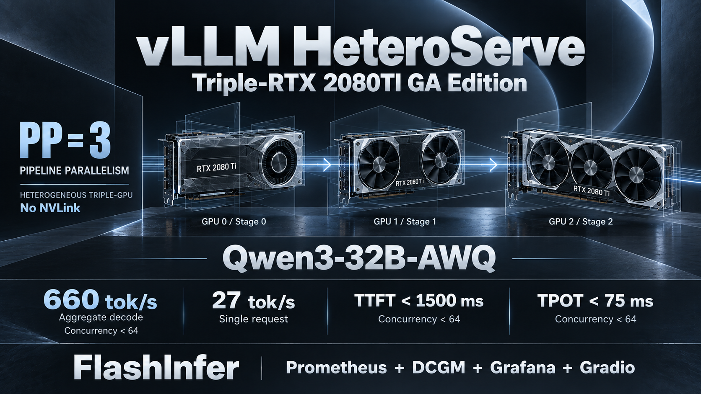
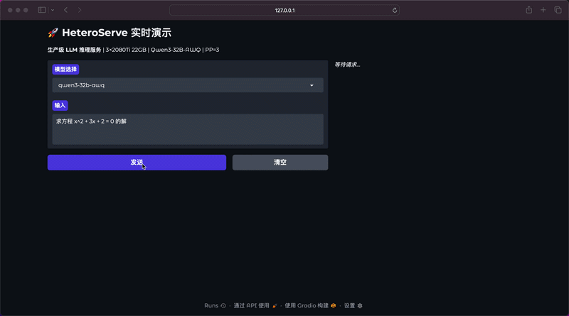
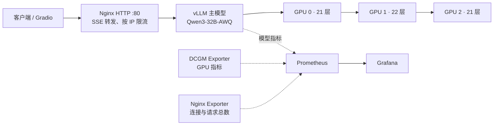

# HeteroServe



存量消费级 GPU, NVIDIA RTX 2080ti x 3, 承载 32B 大模型：从硬件约束、推理部署到性能评估与服务观测的完整工程实践。



[完整演示视频](/demo-app.mp4) · [项目全过程](/JOURNEY.md) · [架构设计](/DESIGN.md) · [迭代路线](/Roadmap.md) 

> 海报中的约 660 tok/s 来自特定短对话负载下的服务端观测；约 27 tok/s 是单请求历史观测。海报中的延迟目标也不代表所有负载均已达标。详细测试条件见下文。

## 项目解决什么问题

随着大模型应用的发展，企业对模型本地部署和私有化服务的需求不断增长。然而，高端 GPU 的采购成本与持续运行的推理开销，也为预算有限的企业带来了压力。如何充分利用现有的中低端和消费级 GPU，通过工程优化提高推理效率，是本项目关注的核心问题。

具体而言，项目探索如何在显存容量、计算能力和互联带宽受限的条件下，通过资源调度、技术选型与工程取舍，实现大模型的高效部署，并在推理成本、响应速度与输出质量之间取得平衡。

在消费级平台上提供可交互的大模型推理服务，需要统筹考虑硬件配置、模型选择、部署方式、并发容量与响应延迟。同时，还需要建立覆盖性能与质量的评测体系，并配套日志、指标监控与告警机制，为服务的持续运行和优化提供依据。

HeteroServe 使用三张显存扩容至 22GB 的 RTX 2080 Ti，总显存为 66GB。三张 GPU 之间无 NVLink 连接，PCIe 链路宽度分别为 x8 / x8 / x4。其余硬件包括 ASUS Z270-A 消费级主板、Intel Core i7-7700 处理器、32GB 内存，以及位于 NVMe SSD 上的 32GB Swap 交换空间。

项目以 Qwen3-32B-AWQ 为主模型，使用 vLLM 的三卡流水线并行，将模型按层分配至不同 GPU，并围绕显存容量、算子兼容性与通信开销进行部署优化。项目保留了启动日志，以及三模型对比、ShareGPT 基准测试、C-Eval 质量评测、KV Cache 分析和业务场景压测的记录；同时集成 Nginx、Prometheus、DCGM、Grafana 与 Gradio，构建可交互、可观测、实验过程可追溯的推理服务原型。

本项目重点探索三张 RTX 2080 Ti 的部署场景。对于主模型 Qwen3-32B，其 64 个 query heads 无法按三路张量并行（TP=3）均分，因此项目采用流水线并行（PP=3），并记录从硬件配置、并行策略选择，到部署优化、评测与监控的完整实践过程，为类似硬件约束下的大模型部署提供参考。

本项目面向关注大模型本地部署、消费级多卡推理、AI Infra 性能分析与服务工程的开发者。当前使用的三张 GPU 型号相同，项目中的异构性主要体现在互联带宽差异以及受限的系统资源配置上；后续计划探索跨代 GPU 的混合调度。

HeteroServe 在技术选型、部署优化、评测与监控方面的方法，也可为高端 GPU 和更大规模的部署提供参考。具体性能结论仍需结合目标硬件、互联拓扑与业务负载重新验证。

当部署环境包含不同数量、型号和架构的 GPU 时，算力、显存与互联带宽的差异会使资源调度和部署优化更加复杂。HeteroServe 从消费级三卡平台出发，探索在硬件约束下构建大模型推理服务的工程方法。

## 工程亮点

- **从硬件约束出发选并行策略。** Qwen3-32B 的 64 个 query heads 无法按 TP=3 均分，主线采用 PP=3、TP=1；历史日志记录层分配为 21 / 22 / 21。
- **打通 Turing 上的实际推理路径。** 主模型日志记录 vLLM 0.21.0、V1、FP16、FlashInfer 和 AWQ-Marlin 成功运行；同时保留 vLLM 0.8.5.post1 的 V0 / xFormers 冒烟对照。
- **同时考察速度、质量和显存。** 对比 32B AWQ、32B GPTQ 与 14B FP16，展示延迟与吞吐的权衡，以及量化后留给 KV Cache 的容量收益。
- **把并发数还原为资源预算。** 主模型启动日志给出约 135K engine KV token 槽位，16K 满长请求的理论容量约 8.27 条；调度上限 64 不等于能同时运行 64 条满长请求。
- **覆盖服务链路与业务负载。** 提供流式代理、模型与 GPU 指标、Grafana 看板、三类 Locust 场景和交互 Demo，让性能问题能关联到队列、缓存和设备状态。

这些能力主要来自对现有开源组件的集成、配置与实验分析；仓库没有实现独立的推理引擎或自研 GPU kernel。

## 实验结果

### ShareGPT 基准：吞吐提升与尾延迟代价

每组 500 个请求，共 3 个模型 × 3 个客户端最大并发设置。各组输入总量为 107,437 tokens，输出约 109K tokens。下表为完整测试期间的**聚合输出吞吐量**及客户端延迟统计。

| 模型 | GPU / 并行 | 客户端最大并发 | 输出 tok/s | TTFT P99 | TPOT P99 |
| --- | --- | ---: | ---: | ---: | ---: |
| Qwen3-32B-AWQ | 3 卡 / PP=3 | 4 | 91.02 | 988.83 ms | 63.51 ms |
| Qwen3-32B-AWQ | 3 卡 / PP=3 | 16 | 241.74 | 2,354.55 ms | 111.02 ms |
| Qwen3-32B-AWQ | 3 卡 / PP=3 | 64 | 381.48 | 16,712.51 ms | 827.87 ms |
| Qwen3-32B-GPTQ | 3 卡 / PP=3 | 16 | 239.68 | 2,386.34 ms | 115.51 ms |
| Qwen3-14B-FP16 | 2 卡 / TP=2 | 16 | 297.02 | 1,692.98 ms | 76.28 ms |

来源：[9 组原始 JSON 与日志](/logs%20&%20reports/06-EXP3-vllm_bench_benchmarks/results/)、[实验说明](/docs/06-exp3-vllm_bench_benchmarks.md)。9 组各完成 500 个请求、各记录 0 次失败。

AWQ 从并发 4 增至 16，输出吞吐约提升 2.66 倍；继续增至 64，尾延迟明显恶化。并发 16 可作为这组负载下的调优候选，但尚不满足原定 TTFT P99 < 1.5s、TPOT P99 < 80ms 的组合目标。14B FP16 速度更快；由于模型规模、GPU 数量和并行方式同时变化，这不是量化算法的单变量对比。

### C-Eval：质量与资源的另一条轴

以下是仓库保存的 validation 汇总结果，均为 52 科、1,346 题，采用 micro accuracy。数值已按各科正确题数重新汇总核对。

| 模型 | Non-thinking | Thinking |
| --- | ---: | ---: |
| Qwen3-32B-AWQ | 82.47% | 84.03% |
| Qwen3-32B-GPTQ | 81.72% | 82.91% |
| Qwen3-14B-FP16 | 78.68% | 80.91% |

来源：[质量评测 JSON](logs%20&%20reports/07-EXP4-ceval_quality_evaluations/)、[评测设计](/docs/07-exp4-ceval_quality_evaluations.md)。当前保留的是逐科汇总，缺少逐题输出和完整运行清单；这些结果可用于说明本项目的选型过程，不能据此断言 AWQ 普遍优于 GPTQ，或宣称达到官方榜单成绩。

### 业务场景：短对话、长输入和长生成

Locust 设计了 A / B / C 三类负载，分别模拟 50 / 20 / 10 个用户，并在服务端 `max-num-seqs=8/16/32/64` 下运行 12 组测试，每组约 10 分钟。历史 Grafana 分析记录短对话生成吞吐约 663 tok/s；这属于小型重复提示集上的服务端窗口速率，与上面的 ShareGPT 全程平均值不可直接比较。

12 份 HTML 报告共记录 9,096 次请求、3 次失败，均出现在 A-32。A-64 报告的全程请求速率约 3.264 req/s、E2E P99 约 14s。完整场景说明见 [Locust 压测](/docs/14-Locust-stress-testing.md)。

## 服务架构



这是主模式的设计关系。另有 14B FP16 / TP=2 冷备配置，与主模型共用 GPU，需停止主模型后人工切换。当前没有自动故障转移、多模型动态路由或跨节点高可用。
## 部署与体验

目标环境是具备 NVIDIA GPU 的 Linux 主机。历史实验使用 Ubuntu 24.04、i7-7700、32GB RAM、NVMe，以及三张 22GB RTX 2080 Ti。模型权重需预先准备到 `/opt/models/Qwen3-32B-AWQ`；备用目录为 `/opt/models/Qwen3-14B`。仓库不包含权重。

容器路径以 [Dockerfile](/Dockerfile) 和 [compose.yml](/compose.yml) 为入口；本地实验环境参考 [environment.yml](/environment.yml)。Compose 默认离线加载模型，主模型默认上下文为 8,192、`max-num-seqs=64`，不同于早期实验的 16,384 上下文。

模型与 NVIDIA Container Toolkit 就绪时的启动入口(不代表本次已完成实机启动验证)：

```bash
docker compose --profile main config
docker compose --profile main up -d --build
docker compose --profile main logs -f vllm-main
```

确认服务健康后，可在服务器上验证流式接口：

```bash
curl -f http://localhost/health
curl -N http://localhost/v1/chat/completions \
  -H 'Content-Type: application/json' \
  -d '{"model":"qwen3-32b-awq","messages":[{"role":"user","content":"用一句话解释 PagedAttention"}],"stream":true,"max_tokens":200,"chat_template_kwargs":{"enable_thinking":false}}'
```

| 入口 | 宿主机端口 | 说明 |
| --- | ---: | --- |
| Nginx | 80 | 统一 HTTP API 入口 |
| 主模型直连 | 8001 | 映射容器 8000；绕过网关 |
| 备用模型直连 | 8002 | 仅 backup 模式启动 |
| Grafana | 3000 | 仪表盘 |
| Prometheus | 9090 | 指标查询 |
| DCGM Exporter | 9400 | GPU 指标 |
| Gradio | 7860 | 单独运行，未加入 Compose |

Gradio 实现在 [scripts/19-gradio_demo.py](/scripts/19-gradio_demo.py)，需先把硬编码的 `API_URL` 配为实际网关地址，并对齐服务端模型名。现有配置为实验环境提供 HTTP 与默认 Grafana 凭据，尚未完成公网服务所需的访问控制。

停止两种模式的服务可使用：

```bash
docker compose --profile main --profile backup down
```

## 阅读导航

| 想了解什么                 | 入口                                     |
| --------------------- | -------------------------------------- |
| 项目如何一步步完成             | [JOURNEY.md](/JOURNEY.md)              |
| 为什么选择 PP、AWQ 与这些服务组件  | [DESIGN.md](/DESIGN.md)                |
| 算子、硬件、容器与监控原理         | [研究笔记](/docs/analysis%20&%20research/) |
| 完整实验与部署记录             | [docs](/docs/)                         |
| 可执行脚本                 | [scripts](/scripts)                    |
| 原始日志与测试报告             | [logs & reports](/logs%20&%20reports/) |
| 面向 AI Infra 与应用落地的下一步 | [Roadmap.md](/Roadmap.md)              |
