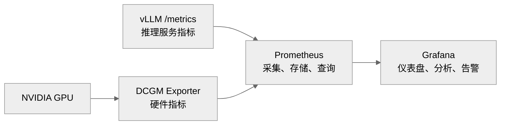

# 1. 架构

为了实现推理服务平台运行的可观测性，我们引入了 Prometheus + DCGM + Grafana 的观测体系。整体上采用 Prometheus + DCGM-Exporter + Grafana 的架构。架构图如下



DCGM 是 Nvidia Data Center GPU Manager, 它负责获取 GPU 层面的各种指标数据和性能数据。

Prometheus 监测各个节点，定期从各个节点上抓取指标。 Prometheus 用统一的方式向各个数据源抓取数据。由于各个数据源的异构性，Prometheus 不会直接访问数据源，而是访问在数据源处的 Exporter 适配器，通过统一方式抓取指标数据，数据源的差异性由具体的 Exporter 处理。本项目中的 Prometheus 主要抓取两个数据源，一个是 vLLM 框架提供的指标数据接口 `vllm/metrics`, 一个是 DCGM-Exporter 提供的 GPU 的指标数据。

| 监控层次    | 数据来源               | 典型指标                                               |
| ------- | ------------------ | -------------------------------------------------- |
| GPU硬件层  | DCGM/DCGM Exporter | GPU利用率、显存、温度、功耗、频率、PCIe/NVLink、ECC/XID错误           |
| vLLM服务层 | vLLM `/metrics`    | TTFT、TPOT、端到端延迟、排队时间、运行/等待请求数、Token吞吐量、KV Cache使用率 |
关于 Prometheus 工作原理的详细讨论，参看 [17-Prometheus](/docs/analysis%20&%20research/17-Prometheus.md)

DCGM-Exporter，是 NVIDA 提供的 DCGM 数据的适配器，它的作用是把 DCGM 读取的 GPU 数据转换成 Prometheus 标准格式指标，暴露在 HTTP `/metrics` 接口，供 Prometheus 抓取。在 Nvidia 官方提供的镜像中 DCGM-Exporter 中已经包含了内嵌的 DCGM 库，如果没有设置远程的 DCGM 服务地址，DCGM-Exporter 就会默认启用容器中内嵌的 DCGM。所以，我们配置中，只启动了DCGM-Exporter服务, 而没有单独启动 DCGM 服务。
关于 DCGM 和 DCGM-Exporter 的详细讨论，参看 [18-DCGM & DCGM-Exporter](/docs/analysis%20&%20research/18-DCGM%20&%20DCGM-Exporter.md)

Grafana是一个看板系统，负责从 Prometheus 服务中查询数据，按照 Dashboard 中的配置，展示Prometheus 的指标数据。使得监控数据可视化。关于 Grafana 的详细讨论，参考 [19-Grafana](/docs/analysis%20&%20research/19-Grafana.md)

Prometheus + DCGM/DCGM-Exporter + Grafana 形成了一个完整的监控架构。Prometheus 负责抓取和存储指标数据，DCGM 负责获取GPU数据，DCGM-Exporter 负责将 GPU 数据转换为 Prometheus 标准格式的指标。Grafana 与 Prometheus 交互，统计和展示指标数据。

Prometheus + DCGM/DCGM-Exporter + Grafana 架构的详细讨论，参考[20-Prometheus+Grafana+DCGM](/docs/analysis%20&%20research/20-Prometheus+Grafana+DCGM.md)
# 2. Prometheus 配置说明

Prometheus 完整的配置文件，参考 [prometheus.yml](/deploy/prometheus.yml)
```yaml
global: {scrape_interval: 5s, evaluation_interval: 15s}
scrape_configs:
	- job_name: 'vllm-active'
	  static_configs:
	    - targets: ['vllm-active:8000']
	  metrics_path: /metrics
	  
	- job_name: 'dcgm-exporter'
	  static_configs:
	    - targets: ['dcgm-exporter:9400']
	      
	- job_name: 'nginx'
	  static_configs:
	    - targets: ['nginx-exporter:9113']
```

Prometheus Server 做了全局配置，抓取指标的时间间隔是 5s, 计算指标的时间间隔是15s. 

Prometheus 一共配置了 3 个抓取工作任务：`vllm-active`, `dcgm-exporter`, `nginx`。
- `vllm-active`: vLLM 框架自身提供了 `/metrics` 的 HTTP 接口，vLLM 部署模型运行的指标数据以 Prometheus 指标格式，暴露在这个接口。Prometheus 可以直接抓取。
  这个 job 下只配置了一个 target, 本项目中，同一时刻只有一个模型在运行。在抓取模型数据上只需要配置一个 target 就可以了。主备模型谁在线上，抓取的就是谁的指标。
- `dcgm-exporter`: 目标是抓取 GPU 硬件层面的运行数据。真正获取数据的是 DCGM，但 Prometheus 不能直接访问。 dcgm-exporter 完成数据格式转换，暴露在统一的 `HTTP /metrics` 接口处，Prometheus 从这里抓取指标。
- `nginx`: 除了直接从  vLLM 和 DCGM 的数据源获取指标外，我们还从 nginx 处抓取数据，以获取流式网关的运行状态。同样，Prometheus 不会直接访问 nginx, 而是访问 nginx-exporter 抓取 Prometheus 标准格式的指标。

Prometheus 正常启动后可以看到


三个 job 下的 targets 都是正常工作，`vllm-active`, `dcgm-exporter`, `nginx` 都是正常 UP 状态。

# 3. 指标

在 Prometheus 抓取指标的三个 targets 中，我们将使用如下指标

| 来源             | 指标名称                                         | 含义                    |
| -------------- | -------------------------------------------- | --------------------- |
| vLLM           | `vllm:prompt_tokens_total`                   | 输入 token 的吞吐量         |
| vLLM           | `vllm:generation_tokens_total`               | 输出 token 吞吐量          |
| vLLM           | `vllm:time_to_first_token_seconds`           | TTFT, Prefill 快慢      |
| vLLM           | `vllm:request_time_per_output_token_seconds` | TPOT, decode 快慢       |
| vLLM           | `vllm:e2e_request_latency_seconds_bucket`    | 端到端延迟                 |
| vLLM           | `vllm:num_requests_running`                  | 正在运行请求数，活跃请求          |
| vLLM           | `vllm:num_requests_waiting`                  | 排队请求数，看积压             |
| vLLM           | `vllm:kv_cache_usage_perc`                   | KV 占用率，看是否逼近上限        |
| vLLM           | `vllm:prefix_cache_hits_total`               | 前缀命中率(RAG/多轮关键)       |
| vLLM           | `vllm:prefix_cache_queries_total`            | 前缀查询总次数               |
| vLLM           | `vllm:request_success_total`                 | 成功计数，算成功率             |
| DCGM           | `DCGM_FI_DEV_GPU_UTIL`                       | 每卡利用率, PP下可见流水线波动     |
| DCGM           | `DCGM_FI_DEV_FB_USED`                        | 每卡显存，看三卡是否均衡          |
| DCGM           | `DCGM_FI_DEV_FB_TOTAL`                       | 总显存                   |
| DCGM           | `DCGM_FI_DEV_POWER_USAGE`                    | 每卡功耗，掉卡前兆             |
| DCGM           | `DCGM_FI_PROF_PCIE_TX_BYTES`                 | PCIe 接受数据流量，PP传输与TP对比 |
| DCGM           | `DCGM_FI_PROF_PCIE_RX_BYTES`<br>             | PCIe 发送数据流量，平均字节速率    |
| Nginx-Exporter | `http_requests_total`                        | HTTP 请求处理速率           |
